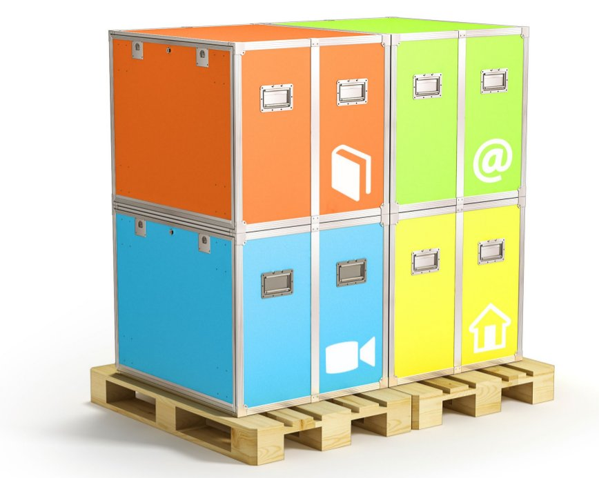

# Manutention de l'IdeasBox

Le déploiement de l'IdeasBox nécessite au minimum un espace minimum de 20 m², si l'assemblage se fait module par module, pour pouvoir tourner autour sans problemes

**Rappel** : les modules sont relativement lourds ! À vide :

* **80 kg** pour les premières versions,
* **50 kg** pour les nouvelles versions \(Hemingway\).

Lorsque vous manipulez un module :

* faites-le à plusieurs, idéalement 4 personnes
* ne jamais plier le dos, mais les genoux
* évitez les chaussures ouvertes \(ex : tongs\)
* mettez des gants en cas de manipulation de modules sans roulettes
* lors du chargement/déchargement d'un véhicule : enlevez de la box tout ce qui peut l'être \(livres, PC portables, générateur\) pour alléger les modules
* pendant les déplacements : évitez d'entrechoquer les modules, ne pas forcer sur les obstacles avec les roulettes \(risque de détériorer les roulements\), s’assurer que les freins des roulettes sont enlevés  _ pour effectuer les déplacements. Protégez les modules avec un carton  _ ou un tissus au besoin
* _Ancien modèle_ Avertissement sur les modules gris : les poignées  _ sont mal placées \(on se pince les doigts si on le prend à l'envers\),  _ utiliser systématiquement des gants pour la manutention des  \* coques grises.

## Montage démontage

Pour mettre ou enlever les roulettes, il faut basculer les modules sur le côté. Attention, le module jaune contient le générateur. Enlevez le générateur avant de pencher le module.

### Roulettes

* Serrez bien les vis,
* Montez les deux roulettes freinées en diagonale
* Faites attention lorsque vous remettez le module sur roulettes :  _ **ne pas forcer sur les roulettes**. Cela risque d'abîmer les  _ roulements et les pas de vis \(soulagez le module avant de le reposer du flanc sur ses roulettes\).

### Ouverture / fermeture

* Lorsque vous déployez l'IdeasBox, il est nécessaire de le faire sur un sol plat. Cela évitera que les modules soient déformés par la  pente et rendra l'ouverture des modules et des portes d'autant plus facile
* _Ancien modèle_ Ne forcez pas lorsque vous refermez les modules afin d'éviter de rayer les autocollants sur les flancs des modules
* _Ancien modèle_ Ne forcez pas lorsque vous refermez les modules afin d'éviter de déformer le rail dans lequel viennent s'insérer les  portes amovibles 
* _Ancien modèle_ Pieds modules gris : monter les mécanismes de verrouillage des pieds, nécessité de les déployer doucement, monter les pieds réglables. Insister sur la nécessité de poser le module à plat afin de ne pas vriller les couvercles.  
* _Ancien modèle_ : Il faut différencier les coques qui peuvent servir d'assise \(bleu, orange\) de celles qui ne peuvent servir que de  table : vert, jaune. N'oubliez pas de monter les manchons supplémentaires qui permettent de renforcer les coques.

## Stockage

Les modules et tables de l'IdeasBox doivent être stockés dans un endroit couvert, au sec, en intérieur. L'IdeasBox ne doit pas rester sous la pluie, spécialement le module bleu qui comporte des risques d'infiltration même fermé lorsque la box est sous une forte pluie.

Il est plus simple de stocker l'IdeasBox montée sur roulette.  
Cependant, si pour des raisons de place vous devez stocker les modules les uns sur les autres, il est indispensable de démonter les roulettes.  
Ne superposez pas plus de 2 modules. Solidarisez-les avec une sangle.  
Mettez les modules les plus lourds en dessous.

Lorsque la box est stockée, fermez tous les modules et sécurisez le tout avec une chaîne antivol. Passez la dans les poignées de l'IdeasBox et le trou au milieu des tables pour solidariser le tout.

## Transport

Pour transporter l'IdeasBox dans un véhicule il est indispensable de :

* démonter les roulettes
* vider le générateur de tous ses fluides
* solidariser les modules avec une sangle
* Ne pas empiler plus de 2 modules
* mettre les modules les plus lourds en dessous

