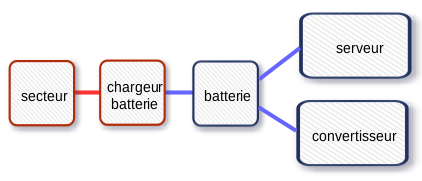

Le circuit électrique est conçu pour fonctionner sur secteur ou sur batterie. Quelques manipulations sont à effectuer pour exploiter la bonne source de courant.

Cette partie du guide se veut concrète et permet de mettre en oeuvre l'électricité sans avoir à comprendre son fonctionnement ; cependant, comprendre sa conception permet d'exploiter au mieux l'utilisation de la batterie. On commencera donc par expliquer simplement les principaux éléments du circuit, les détails techniques seront abordés plus loin.

## Le bouton de sélection du courant

Le gros bouton à trois positions permet de sélectionner la bonne source d'électricité.

#### OFF

À sélectionner lorsqu'on n'utilise plus la box.

**Si la box est toujours branchée sur le secteur**, alors le chargeur de batterie est alimenté et recharge toujours la batterie.

Le circuit se résume alors ainsi :

**Si la box n'est plus reliée au secteur**, alors le circuit se résume alors ainsi :

Les autres équipements ne sont alors plus alimentés.

* **SAUF** le serveur, qui lui est toujours alimenté par la batterie, il faut penser à l'éteindre \(soit depuis l'interface, soit en appuyant brièvemement sur le bouton ON/OFF en façade\).
* **SAUF** le convertisseur, qui alors ne sert plus à rien ; il convient de l'éteindre.

#### 12V

À sélectionner pour utiliser la batterie.

Lorsqu'on sélectionne cette source, il faut allumer également le convertisseur pour utiliser la télévision ou la multiprise \(sans quoi le 12V qui sort de la batterie n'est pas transformé en 200V, et ces deux équipements ne sont pas alimentés\).

Le circuit se résume alors ainsi :

#### 220V

Utilisation du courant secteur.

Tous les équipements sont alimentés ; le convertisseur peut alors être éteint ; la batterie se recharge automatiquement.

Le circuit se résume alors ainsi :

## Brancher la box sur secteur

On commence par brancher le câble IEC depuis la prise secteur jusqu'à la prise IEC présente sur le module bleu.

Le bouton de sélection doit être positionné sur « 220V ».

Le convertisseur peut être éteint.

==&gt; Tous les équipements électriques sont utilisables.

## Utilisation sur batterie

Le bouton de sélection doit être positionné sur « 12V ».

==&gt; Si le convertisseur est éteint, alors seul le serveur est alimenté.

Il faut allumer le convertisseur pour alimenter la télévision et la multiprise (c'est lui qui transforme le 12V issu de la batterie en 220V nécessaire à la TV et à la multiprise\).

==&gt; La TV et la multiprise sont utilisables.

==&gt; Lorsque la box fonctionne sur batterie, le chargeur USB \(pour les tablettes\) n'est pas utilisable.

#### Pas d'utilisation de la box

* Il faut sélectionner la position OFF.
* Il faut éteindre le serveur.
* Il faut éteindre le convertisseur.

Si on veut que la batterie se recharge, alors il faut laisser le câble IEC branché du secteur à la box.

Sinon, il faut impérativement débrancher le câble et le ranger.

