L’électricité est au coeur des fonctionnalités de l’IdeasBox et connaître son fonctionnement permet de décupler ces possibilités d’usages.

Ce qui va suivre vaut pour les IdeasBox et n’a pas vocation à former des électriciens en dehors des Ideas Box.

## Présentation du circuit électrique

L'IdeasBox intègre un circuit électrique. Il sert à :

* alimenter la télévision
* alimenter le serveur
* recharger les tablettes via un chargeur USB 18 ports
* brancher ponctuellement d'autres appareils électriques \(chargeur d'ordinateur portable, de tablettes, imprimante\). Pas d'appareils de puissance !

**Tout cela peut aussi bien fonctionner sur secteur électrique 220v ou batterie 12v en mobilité **

#### On trouve les éléments suivants

---

* **1 Batterie 12v 90Ah**

  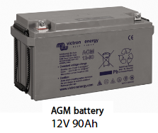
  
  La batterie est chargée en permanence par le chargeur de batterie. La batterie joue le rôle d'accumulateur et délivre une tension 12v à tous les appareils connectés à ces bornes \(serveur, prises allume cigare, convertisseur 12v -&gt; 220v\)

** IMPORTANT:  ** La batterie est considérée comme complètement déchargée lorsque la tension à ses bornes est inférieure ou égale à 10,8v

---

* **1 Chargeur de batterie 12v**

  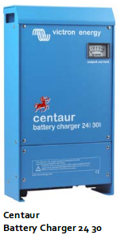
  
  Cet appareil permet la recharge de la batterie 12v en 3 étapes \(Bulk – absortion – floating\). Il peut rester connecté à la batterie en permanence sans créer aucun dommage à cette dernière.
  
**BON A SAVOIR: ** Cet appareil permet d'indiquer si ce dernier charge ou non la batterie. En effet, le "VU-mètre" (case blanche en haut à droite) indique la quantité d'intensité injectée dans la batterie pour la recharger. Si l'aiguille est orientée vers la droite (20, 30A) la batterie est en cours de charge ; si l'aiguille est proche de 0, la batterie est rechargée.

---

* **1 Serveur Web Peren IT 12 v**

  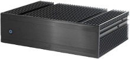
  
  Il s'agit du serveur stockant des contenus vidéos, des fichiers PDF et tout un tas d'autres médias. Une fois démarré, il créé un hotspot Wifi. Il est directement alimenté par la batterie.

---

* **1 télévision**

  
  
  La télévision fonctionne uniquement en 220v. Lorsque le 220v n'est pas présent, elle est alimentée directement depuis le convertisseur 12v -&gt; 220v

---

* **1 Convertisseur 12v –&gt; 220v**  

  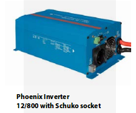
  
  Ce convertisseur permet de créer une tension alternative 220v à partir de la tension 12v de la batterie. L'utilisation de ce convertisseur est obligatoire lorsque l'IdeasBox n'est pas connecté au secteur 220v. Grâce à ce convertisseur il vous est donc possible d'alimenter en électricité 220v le module vidéo contenant la Télé, de faire fonctionner le serveur et de recharger les ordinateurs portables.

  Caractéristiques :

  * Puissance du convertisseur à 25°C : 800 VA  
  * Puissance du convertisseur à 25°C/40°C : 700 W  
  * Puissance crête : 1600 W  
  * Alarme batterie basse : 10,9 V  
  * Rendement maximal : 91 %

---

* **1 prise d'alimentation générale et sa prise IEC femelle**

  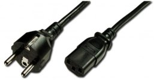
  
  La prise standard 2 broches + terre permet de relier l'IdeasBox au réseau 220v ou à un générateur, l'autre extrémité se branche directement sur la prise male IEC du module électrique \(bleu ou jaune suivant le modèle\)

* **1 prise male IEC**

  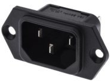

---

* **1 disjonteur différentiel 30 mA \(nouvelle version\)**

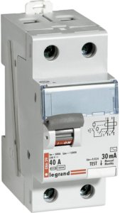

Un disjoncteur différentiel est un dispositif de protection capable d'interrompre le courant électrique en cas d'incident sur le circuit électrique.

---

* **1 disjonteur 10A et 16A \(nouvelle version\)**

Un disjoncteur permet de protéger contre les surintensités et d'ouvrir un réseau électrique et donc d'isoler les appareils en aval du disjoncteur du reste du circuit électrique. Il faut voir son usage comme un interrupteur ON/OFF. Le disjoncteur de 10A est utilisé entre autre pour la protection du convertisseur 12v -&gt; 220v, celui de 16A notamment pour le chargeur USB.

---

* **1 chargeur USB **

  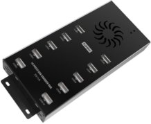
  
  Comporte 10 ou 20 ports USB permettant de recharger simultanément plusieurs tablettes 

---

* **1 Switch 3 positions \(12v -&gt; Rien -&gt; 220v\) \(nouvelle version\)**

  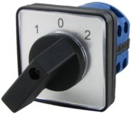
  
  Sur le nouveau modèle \(électricité dans le module bleu\) ce switch 3 positions permet de sélectionner facilement le mode d'alimation du module. Sur secteur \(220v\) ou sur batterie \(12v\)

---

* **1 multiprises**

  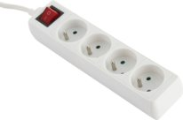
  
  La multiprises peut être connectée directement sur le réseau 220v ou à l'arrière du convertisseur 12v -&gt; 220v, cela permet ainsi d'alimenter directement plusieurs appareils \(ex: chargeur de PC portable\) à partir de la batterie
  
---

* **Prises allume cigare \(ancien version\)**

  
  
  Ces prises peuvent alimenter des appareils ayant besoins d'être rechargés soit directement en 12v, soit en 5v à l'aide d'un convertisseur USB 12v → 5v. Ces prises sont directement alimentés par la batterie.

---

### Liste des appareils alimentés en...

#### 220 V

* la télévision,
* le chargeur USB 18 ports
* le chargeur de batterie \(permet le rechargement de la batterie\)
* Une prise multiple permet de brancher 4 ou 5 autres appareils supplémentaires

#### 12 V

* la télévision via le convertisseur 12v –&gt; 220v
* Le serveur Peren-IT directement connecté sur la batterie. Ce dernier peut être débranché du circuit pour être emporté ailleurs. Il est donc fourni avec un transformateur 220v -&gt; 12v
* D'autres appareils, à concurrence de 2 selon leur consommation sur le convertisseur 12v -&gt; 220v. Celui-ci ne pouvant fournir que 800 Watts, il faut limiter le nombre d'appareils branchés dessus lorsque la box fonctionne en totale autonomie \(sur batterie\). Cas d'usage : Télé \(35 W\) + 2 ordinateurs \(374 W chacun\) = 773 W.

Il est fortement conseillé de **ne pas brancher le chargeur USB 18 ports** directement sur le **convertisseur 12v -&gt; 220v **car ce dernier pourrait vider la batterie rapidement. Nous vous conseillons plutôt de recharger l'ensemble des tablettes la veille ou lorsque vous avez accès à un réseau 220v

**Maintenance du générateur** :  
Faire une vidange du générateur toutes les 80H \(soit une fois par mois a priori\). Il est important de noter les heures de fonctionnement afin de faire un suivi de l'utilisation du générateur.

## Schéma simplifié
Ce schéma montre l'utilisation du chargeur de batterie conjointement avec le convertisseur 12v -> 220v

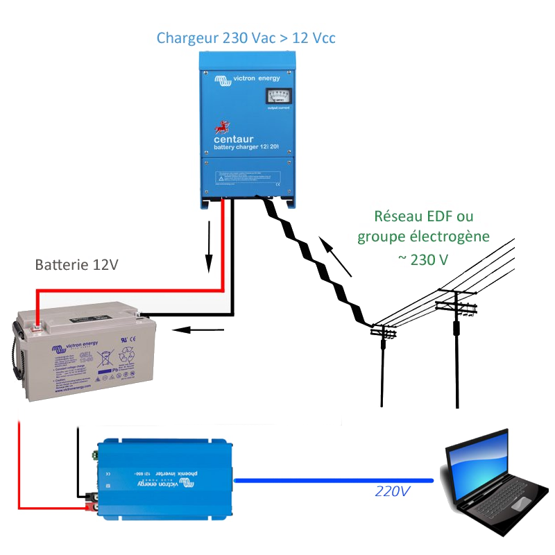

## Cas pratique : Bilan énergétique de la box

Capacité de la batterie : 90 Ah @ 12V

Voici un tableau de la consommation en **Ampère** par **Heure** à 220 V

| Appareil | Energie consommé \(A\) | Temps d'utilisation quotidien \(h\) | Consommation quotidienne \(Ah/jour\) |
| --- | --- | --- | --- |
| TV | 0.16 A | 3h | 0.16 A \* 3h = 0.48 Ah/j |
| Module de recharge | 0.68 A | 8h | 0.68 A \* 8h = 5.44 Ah/j |
| Alimentation de l'antenne wifi | 0.3 A | 7h | 0.3 A \* 7h = 2.1 Ah/j |
| Alimentation du serveur | 1.5 A | 7h | 1.5 A \* 7h = 10.5 Ah/j |
| Ordinateur portable | 1.7 A | 4h | 1.7A \* 4h = 6.8Ah/j |

Total de la consommation : 25.3 Ah/j

**Le convertisseur à un rendement de 91% maximum**

Bilan total à la sortie du convertisseur 12V -&gt; 220V = 25.3 Ah / 0.91 = 26 Ah/j

Donc pour une batterie de capacité de 90 Ah -&gt; nous souhaitons 80% de décharge max = 90 \* 80 / 100 = 72 Ah de disponible car on ne souhaite pas décharger complètement la batterie.

72 Ah / 26 Ah = 2.7h de fonctionnement sur batterie

Dans un contexte de déploiement de la Box pendant 7h, dans un lieu sans électricité, nous partons du principe que nous avons besoins uniquement du serveur, de l'antenne wifi, de la télé et de recharger les ordinateurs pendant 4h. Voici une estimation du temps de fonctionnement sur batterie.

| Appareil | Energie consommé \(A\) | Temps d'utilisation quotidien \(h\) | Consommation quotidienne \(Ah/jour\) |
| --- | --- | --- | --- |
| TV | 0.16 A | 4h | 0.16 A \* 3h = 0.48 Ah/j |
| Alimentation de l'antenne wifi | 0.3 A | 7h | 0.3 A \* 7h = 2.1 Ah/j |
| Alimentation du serveur | 1.5 A | 7h | 1.5 A \* 7h = 10.5 Ah/j |
| Ordinateur portable | 1.7 A | 4h | 1.7A \* 4h = 6.8Ah/j |

Total de la consommation : 19.88 Ah/j

Bilan total à la sortie du convertisseur 12V -&gt; 220V = 19.88 Ah / 0.91 = 20,6 Ah/j

Donc pour une batterie de capacité de 90 Ah -&gt; nous souhaitons 80% de décharge max = 90 \* 80 / 100 = 72 Ah de disponible car on ne souhaite pas décharger complètement la batterie.

72 Ah / 20.6 Ah = 3.5h de fonctionnement sur batterie

