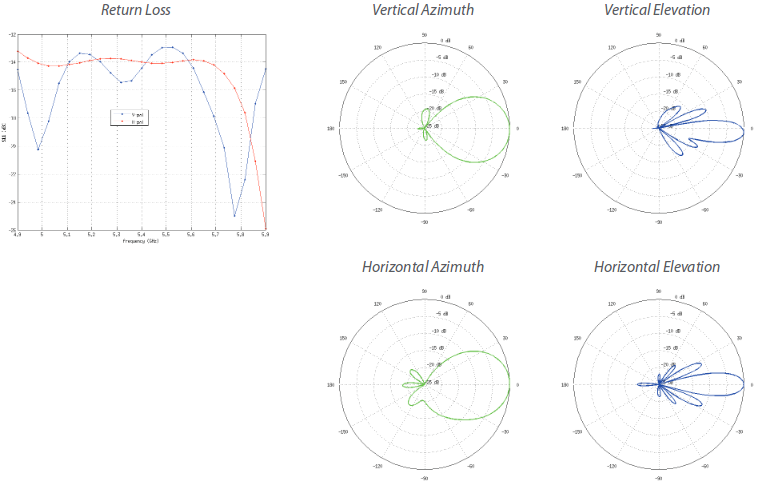

# Lien Internet Radio (ubiquiti)

Les antennes Wifi Ubiquiti permettent d'établir des liaisons sans fil. 
Elles supportent 3 modes de fonctionnement 
- Station
- Acces point
- AP-Repeater

Dans notre contexte nous utiliseront nos antennes wifi en mode **Access-Point** et **Station** afin de créer une liaison wifi entre 2 antennes permettant de distribuer Internet sur une longue distance.

**Avant tout déploiement il est absoluement nécessaire de faire une étude de faisabilité pour avoir une rapide idée de ce que l'on sera capable de faire.**

L'essentiel est de baser son étude sur des photos prises entre le point A et le point B afin de déterminer si un lien direct peut être établie. C'est certainement l'étape la plus importante ! 

Ensuite il est [possible de calculer les pertes en dB](https://www.pasternack.com/t-calculator-fspl.aspx) entre deux antennes si l'on connait le gain de l'antenne, la distance entre les deux points et la fréquence utilisé. Par exemple un arbre situé entre les deux antennes fera chuté la puissance du signal de 5dB...

Tout d'abord, [utilisez AirLin](https://airlink.ubnt.com/), un outil en ligne distribué par Ubiquiti afin de vérifier la distance entre votre point A et votre point B. Le logiciel vous donnera également une indication sur l'élévation du terrain et la hauteur à prévoir pour le mat supportant l'antenne.
Vérifier également sur [GeoPortail](http://www.geoportail.gouv.fr) si le déploiement est France vous aurez ainsi accès à l'altitude de vos lieux d'installation, c'est toujours bien de recouper l'information.
Sinon sur Google Maps ou Open Street Maps pour avoir une petite idée des batiments qui pourrait se trouver sur le chemin des antennes.

Pour bien fonctionner, vos antennes doivent "se voir". Il est donc essentiel de pouvoir les places à bonne hauteur. Si un batiment se trouve entre les deux antennes, il est fort possible que le lien ne puisse être fait.

Si vous ne pouvez pas vous déplacer sur le terrain. Discutez avec votre partenaire pour qu'il vous fournisse un maximum d'informations.
- Coordonnées GPS du point A et point B
- Altitude des deux point de déploiement 
- Nature des batiments au point A et B (local, maison, immeuble, combien d'étage, peut accrocher l'antenne quelque part, peut-on poser un mat, etc.)
- Il y a t-il des batiments haut entre le point A et le point B ? 
- Est ce que l'antenne peut être placé plus haut que ces batiments ? 

##Caractéristique techniques 
* Modèle : [Nanostation M5](http://www.ldlc.com/fiche/PB00142273.html) 
* Prix indicatif : 99 €
* Alimentation : 0.5 A @24V (alimentation fournie)
* Puissance consommée max : 8W  
* Gain : 16 dBi
* Température de fonctionnement : -30 à 75°C  
* Fréquence de fonctionnement : 5170 - 5875 Hz
* Largeur de faisceau : 43° (H-pol) / 41° (V-pol) / 15° (Elevation)

Les abaques ci-dessous permettent de donner les angles vertical et horizontal couvert par l'antenne wifi. Par exemple on peut remarquer que la "Vertical Elevation" à un angle qui permet d'envoyer les ondes vers le sol plutôt que dans les airs.

---

## Généralités sur la radio

*Une radiocommunication est une télécommunication effectuée dans l'espace au moyen d'ondes électromagnétiques. Ces ondes constituent une propagation d'énergie se manifestant sous la forme d'un champ électrique couplé à un champ magnétique.
L'information est transportée grâce à une modulation constante des propriétés de l'onde, soit son amplitude, sa fréquence, sa phase ou, entre autres, par la largeur d'une impulsion.* (Réf [wikipedia](https://fr.wikipedia.org/wiki/Radiocommunication))

**Unités**
* échelle : hertz
* largeur de bande : hertz
* puissances : watt

Le réseau wifi fonctionne sur la bande fréquence : 2.4 ghz ou 5 ghz

Il est possible de calculer la porté d'un réseau wifi grâce à la formule suivante :
$$D = G x P$$
 - D: distance
 - G: Gain de l'antenne en dBi
 - P: Puissance en watt
 
## Configuration et mise en oeuvre

### Matériel à prévoir 
* Acheter plusieurs adaptateurs passifs - 
* Ajouter un multimètre (dans la valise à moustaches normalement)
* ajouter du colson dans la boite (à ajouter dans la valise à moustaches)
* Amener **PLEINS** de câbles Ethernet

### Première connexion
Suivez le plan de montage disponible dans la boite de l'antenne. Deux câbles réseaux seront nécessaire au montage.

Au premier lancement l'antenne est acessible à l'adresse [http://192.168.1.20](http://192.168.1.20), vérifiez avant le démarrage de l'antenne que cette adresse IP n'est pas attribué à une autre machine, si cela le cas, cela engendrera un conflit d'adresse IP et votre antenne ne sera pas accessible.

Une fois connecté au site web, entrez les identifiants par défaut (à changer après la première connexion)

**Login: **ubnt   
**Mot de passe: **ubnt

désactiver https pour l'accès à la console d' admin

-----
**Note sur le protocole AirMax:**  
*airMAX is Ubiquiti’s proprietary Time Division Multiple 
Access ( TDMA) polling technology. airMAX improves 
overall performance in Point-to-Point (PtP) and 
Point-to-MultiPoint (PtMP) installations and noisy 
environments because it reduces latency, increases 
throughput, and offers better tolerance against 
interference.*  
Ce protocole étant propriétaire nous préférons le laissez désactivé dans la mesure du possible 

**Note sur airView: **  
*Use the airView Spectrum Analyzer to analyze the noise 
environment of the radio spectrum and intelligently select 
the optimal frequency to install a PtP airMAX link. *

> A chaque changement de configuration, n'oubliez pas de cliquer sur **Apply** pour prendre en compte vos modifications

## 1ere antenne 
Il s'agit de l'antenne qui va délivrer l'accès Internet et qui sera donc connecté au réseau des réseaux.

### Premier onglet
- Décocher l'option airMax

### Onglet WIRELESS
La Consommation est d'environ 3 à 4 watts

- **Wireless mode**: Access-Point
- **Activer WDS**
- **SSID**: Sélectionner un SSID, celui-ci devra être le même pour les 2 antennes
- **Country Code**: Chaque pays dispose de sa propre régulation au niveau des normes de radiocommunication. Sélectionnez le pays dans lequel vous déployez cet équiement 
- **Channel Width** : Séléctionnez `20 Mhz`. Plus ce chiffre est élevé plus la vitesse de transmission des données est élevés. Cependant cette fréquence est également compatible avec le standard wifi utilisé par les appareils mobiles. Enfin il est également possible d'utiliser le paramètre `Auto 20/40Mhz`
- **EIRP Limit** : Cocher cette case, cela permet de de contraindre l'appareil à suivre les régles définis par le **country code**. Cependant, si vous constater un problème de liaison entre les 2 antennes, décochez le `EIRP Limit` et mettre  à fond le curseur de `output power`, sachez cependant que votre équipement ne respectera plus la loi du pays et que vous exposez vous ou votre partenaires à des poursuites.
- **Wireless security** : Sélectionnez WPA2 et choisir un mot de passe
- **Frequency** : choisir 5180. Quand on utilise des antenne en mode relais : choisir 2 fréquences éloignées pour éviter les collusions entre les fréquences

### Onglet NETWORK
- **Network Mode**: Bridge
- **Management Network Settings**: 
  - Static
  - IP Address : Choisissez une adresse IP disponible sur le réseau et si possible bloquer cette adresse IP dans le serveur DHCP afin qu'elle ne soit pas attribué à une autre machine.     
**Attention: ** Les 2 bornes wifi devront être sur le même réseau local pour pouvoir communiquer.

### Onglet ADVANCED
- Instal EIRP Control: Cochez cette case

## 2nd antenne 

### Onglet WIRELESS
La Consommation est d'environ 3 à 4 watts

- **Wireless mode**: Station
- **Activer WDS**
- **SSID**: Sélectionner un SSID, celui-ci devra être le même pour les 2 antennes
- **Country Code**: Chaque pays dispose de sa propre régulation au niveau des normes de radiocommunication. Sélectionnez le pays dans lequel vous déployez cet équiement 
- **Channel Width** : Séléctionnez `20 Mhz`. Plus ce chiffre est élevé plus la vitesse de transmission des données est élevés. Cependant cette fréquence est également compatible avec le standard wifi utilisé par les appareils mobiles. Enfin il est également possible d'utiliser le paramètre `Auto 20/40Mhz`
- **EIRP Limit** : Cocher cette case, cela permet de de contraindre l'appareil à suivre les régles définis par le **country code**. Cependant, si vous constater un problème de liaison entre les 2 antennes, décochez le `EIRP Limit` et mettre  à fond le curseur de `output power`, sachez cependant que votre équipement ne respectera plus la loi du pays et que vous exposez vous ou votre partenaires à des poursuites.
- **Wireless security** : Sélectionnez WPA2 et choisir un mot de passe
- **Frequency** : choisir une fréquence éloigné de 5180. Quand on utilise des antenne en mode relais : choisir 2 fréquences éloignées pour éviter les collusions entre les fréquences

### Onglet NETWORK
- **Network Mode**: Bridge
- **Management Network Settings**: 
  - Static
  - IP Address : Choisissez une adresse IP disponible sur le réseau et si possible bloquer cette adresse IP dans le serveur DHCP afin qu'elle ne soit pas attribué à une autre machine.     
**Attention: ** Les 2 bornes wifi devront être sur le même réseau local pour pouvoir communiquer.

## Dépannage et conseils
**Chan IRC** : `#tetaneutral` sur freenode ou `#lqdn`
guerby    
**Pour débuguer** : tcpdump ou wiresharkœ + ping

## Documents de références : 
- [Wikipedia](https://en.wikipedia.org/wiki/Ubiquiti_Networks)
- [Page du produit](https://www.ubnt.com/airmax/nanostationm/)
- [Quick start guide](https://dl.ubnt.com/guides/NanoStation_M/NanoStation_M_Loco_M_QSG.pdf)
- [AirOS Guide](https://dl.ubnt.com/guides/airOS/airOS_UG.pdf)
- [Data Sheet](https://dl.ubnt.com/datasheets/nanostationm/nsm_ds_web.pdf)