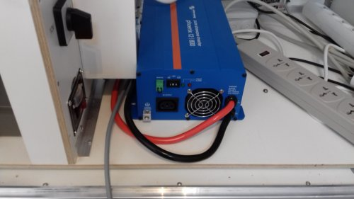
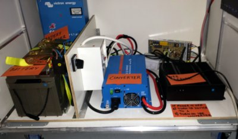
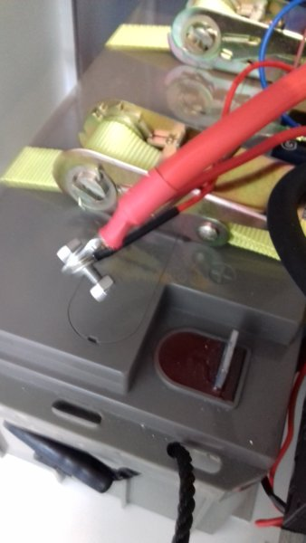
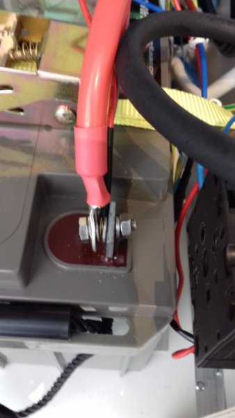

The Ideas Box includes a battery so it can function autonomously in areas where the electricity is unstable or absent.

For safety reasons, the battery is not connected to the electronic appliances of the blue module.  Thus, to set up this module, you have to connect the battery to the rest of the electronic elements of the box.

## Disconnect the Devices

### Disconnect the Server

Verify that the Ideas Box server is not connected to the 12-V cable leading to the battery's electric terminals (this cable has a red wire and a black wire)

### Disconnect the Blue Module from the Main Power
### Turn off the Converter

Verify that the 12 V -> 220 V converter is not turned on.  Set the 3-position switch to **0**

### Remove the White Shelf and Drawer

Remove the white shelf that divides the module into two, and then the drawer above.  This will provide easier access to all of the elements located in the module.
>>>>>>We suggest you do this in a well-lit area in order to distinguish the colors of the different terminals in the battery.

### Connect the Electronic Terminals 
1. Connect the black wire to the - (minus) terminal of the battery.  Do not be surprised if there is a small spark if you touch the + terminal of the battery with the end of your wire 
2. Connect the red wire  to the + (red) terminal of the battery. 
3. You should now have the red wire connected to the + and the black wire to the -.  

### Starting Up
1. Replace the white shelf and the drawer above the devices
2. Reconnect the server to the 12-V cable from the battery
3. Turn on the 12 V -> 220 Vconverter
4. Reconnect the blue module to the 220-V main power
5. Check to make sure the battery is charging correctly.  The VU meter of the device should indicate a position between 0 and 30 A.