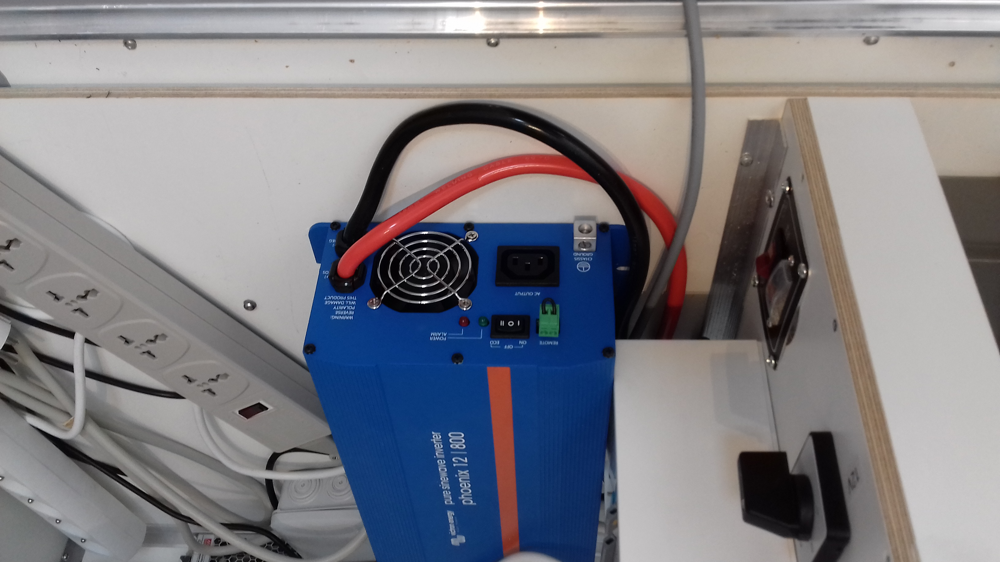
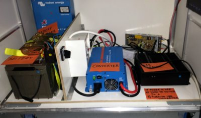
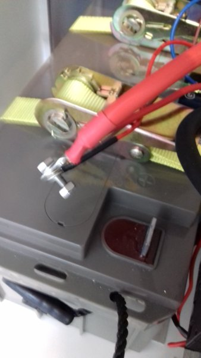
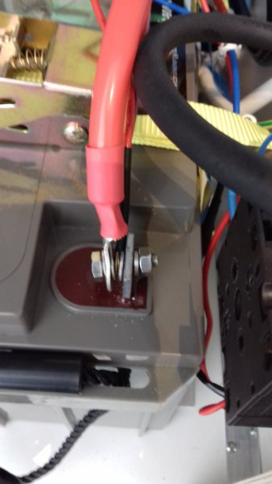
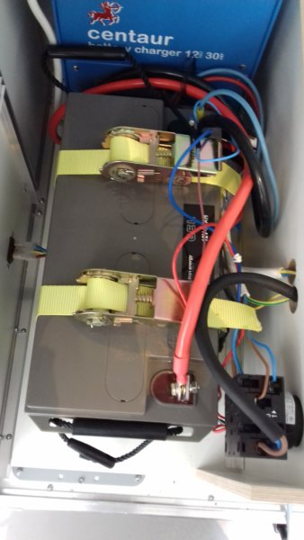

L'ideasbox embarque une batterie afin de pouvoir fonctionner en autonomie dans des contextes où l'électricité est instable ou absente. 

Pour des raisons de sécurités, la batterie n'est pas branché au réseau électrique du module bleu. Il faudra donc dès la mise en service du module, connecter la batterie au reste des éléments électriques de la box. 

## Déconnecter les appareils

### Déconnecter le serveur

Vérifier que le serveur IdeasBox n'est pas connecté au câble 12v menant aux cosses électrique de la  batterie représenté par un fil rouge et un fil noir 
### Eteindre le convertisseur

Vérifier que le convertisseur 12V -> 220V ne soit pas allumé pour cela assurer que le switch 3 positions soit sur la position du milieu "0"

### Enlever l'étagère blanche

Enlever l'étagère blanche séparant le module en deux, cela vous permettra d'accèder plus facilement à tous les éléments situés dans le module

### Branche les cosses électriques 
1. Connecter la cosse du fil rouge  sur la borne + (rouge) de la batterie 
2. Connecter la cosse du fil noir  sur la borne - (moins) de la batterie
3. Vous devriez donc avoir le fil rouge sur le + et le fil noir sur le moins 

### Mise en service
1. Replacer l'étagère blanche au dessus des appareils
2. Rebrancher le serveur au câble 12v venant de la batterie
3. Allumer éventuellement le convertisseur 12v -> 220v
4. Raccorder le module bleu au secteur 220v 
5. Contrôler que le chargeur de batterie charge correctement la batterie, le VU mètre de l'appareil devrait indiquer une position entre 0 et 30A