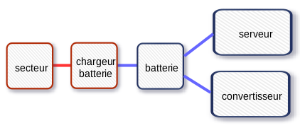
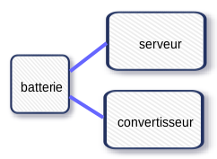
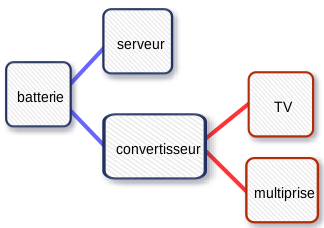
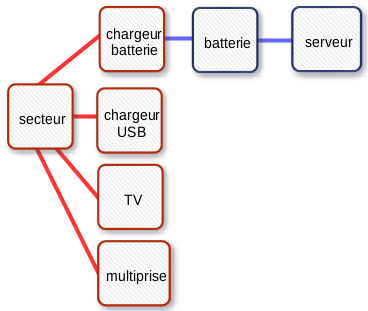

The electrical circuit is designed to function with main power or with the battery.  Some steps can be taken to take advantage of the right source of currect.

This part of the guide is meant to be practical, and help implement the elctricity without necessarily understanding how it works.  However, understanding its design will help you use the battery better.  We will thus start by explaining simply the principal elements of the circuit; the technical details will be tackled later on.

## The Button to Select the Current

The big button with three positions allows you to select the best source of electricity.

#### OFF

Turn the button to this position when the box is off.

**If the box is always connected to the main power grid**, then the battery charger is always on and always recharging the battery.

In this case, the circuit looks like this:

**If the box is no longer connected to the main power grid**, then the circuit looks like this:

The other equipment is no longer powered.

* **EXCEPT** the server, which is always powered by the battery.  The user must manually turn it off (either through the online interface or by briefly pressing the ON/OFF switch on its front).
* **EXCEPT** the converter, which no longer serves a purpose; it should be turned off.

#### 12 V

Select this to use the battery.

When you selects this source, **you also have to turn on the converter to use the television or the power strip**.  Without doing so, the 12 V from the battery will not be transformed to 200 V, and these devices will not work. 

The circuit looks like this:

#### 220 V

Select this to use the main power supply.

All equipment will be turned on.  The converter can thus be turned off.  The battery will recharge automatically.

The circuit looks like this:

## Connecting the Box to the Main Power

Start by connecting the IEC cable from the power outlet to the IEC cable from the blue module.

The selection button needs to be in the **220 V** position.

The converter can be turned off.

==&gt; All devices are available for use.

## Using the Battery

The selection button needs to be in the **12 V** position.

==&gt; If the converter is turned off, only the server will turn on. 

You have to turn on the converter to turn on the television and the power strip (it is this that transforms the 12 V from the battery to the 220 V necessary for the television and power strip).

==&gt; The TV and the power strip will now be usable.

==&gt; When the box runs on battery, the USB charger for the tablets is not usable.

#### When Not Using the Box

* Turn the selection button to **OFF**
* Turn off the server.
* Turn off the converter.

If you want the battery to recharge, leave the IEC cable connected to the outlet and the box.

If not, you must unplug the cable and store it.