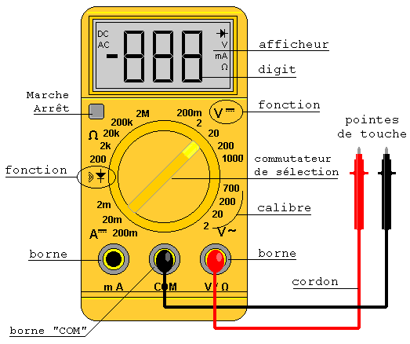
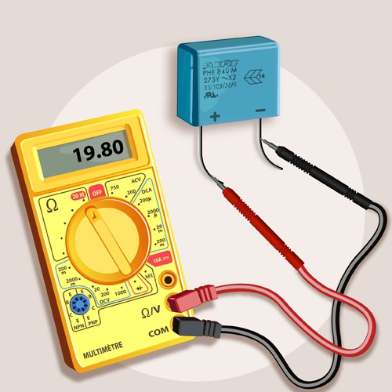

## General Safety Concepts

>>>>Electricity is dangerous, and can hurt or even kill you.  It is thus **VERY IMPORTANT** to respect safety instructions when you work with an electronic system.

**Essential Rules to Follow**

* First of all, **NEVER WORK WITH LIVE WIRES**.  That means unplug equipment from the power source before conducting any maintenance.  Always stop the generator, unplug the battery, unplug cords from outlets, etc...  **ALSO** if you have any doubt at all, check with a multimeter that the circuit is open--that no current is present in the circuit and there is no electricity. Do not hesitate to check several times if you have any doubt.  And if you take a break from the project or leave the site, re-check that there is no current in the wires each time you begin work again.  This is absolutely necessary every time and must never be skipped to avoid risk of serious injury or death.
* When one breaks an electrical circuit, whether by unplugging a cable or by using a circuit breaker, have somebody present to make sure no one plugs the cable back in or flips the circuit breaker.  Make sure this person is conscious of the importance of his or her job, and doesn't stop monitoring their post. 
* Avoid working in a wet environment: do not work with electricity in the rain or with your feet in water.  The current always wants to go to the earth, and will not hesitate to pass through you if possible. 
* **NEVER work in bare feet** on an electric circuit.  If you need to (even when wearing shoes), you can put a rubber mat down or a floor covering to separate you and the ground.
* If you need to work on an electrical circuit, do not do it in a loud environment, or with a lot of people around.  Have other people leave the site and work in a calm, dry, and well-lit environment.  Similarly, do not work on an electrical circuit in an emergency (except to switch it off, of course).  Do not work on a circuit if you are tired, stressed, or distracted.  You need to be able to concentrate entirely on the work at hand, without being distracted. 
* Make sure to **NEVER short circuit** the system.  A short circuit occurs when electricity travels through an unintended path with less resistance than expected.  It can occur if you directly connect the + and the - (also known as the phase and the neutral), without having any devices that use energy in between.  If the system is short circuited, the electrical installation is immediately destroyed.  It can also be incredibly dangerous for you and everybody around, as it can easily cause fires and explosions.  
* If you are not confident in yourself, or the work conditions, it is better not to do anything at the moment and solve the problem later on.  The risks are greater if you are doubtful while you work. 

## General Concepts: Amperes/Watts/Volts

There are three distinct units to measure electricity:  
1. **Volts (V)** are the unit used to measure tension, or potential difference in electricity in a circuit between point A and point B, and are measured by a voltmeter.  It is named after the Italian physicist Volta, who invented the electric battery.  
2. **Watts (W)** are used to measure electrical power (energy divided by time).  1 watt is defined as 1 joule (a unit of energy) per second.  The term comes from the name of Scottish engineer James Watt, who was instrumental in the creation of the steam engine.  
3. **Amperes (A)** measure the intensity of an electrical current, or the movement of electrons through a conductor.  It is named after André-Marie Ampère, the inventor of the electromagnet.
We can compare the movement of electrons in a circuit to that of water in a hose: the intensity, expressed in amperes, is the flow rate of the water.  On the electrical panel installed in houses, fuses or circuit breakers indicate different levels of intensity: 10, 20, or 32 amps.  If the electrical power demanded is more than the available electron flow, the circuit trips.  

We can link all three units with this formula: **P=I x V**.  (Power in watts = current in amps multiplied by electric potential in volts).

**This formula is important: P=IV**

_Here is a concrete example: a device powered by 220 volts consumes 2 amperes. _

> Its power is thus: P=IV = 220 x 2 = 440 watts

_It can be used the other way around as well.  A device powered by 12 volts consumes 36 watts.  How can you calculate its usage in amperes?_

> Divide the power P (in watts) by the voltage to obtain the intensity in amps.  Thus: 36/12 = 3 amps.  The device consumes 3 amps.

## Using a Multimeter 

The multimeter is a device that lets you:  
- Measure the current at the terminals of a device (parallel connection)
- Measure the current that traverses a circuit (chain connection)
- Measure the resistance of a device

With an Ideas Box, the only relevant function is to measure the current at the terminals of a device. 

#### Connecting a Voltmeter (parallel to the battery terminals):
- Use the terminals V and COM of the multimeter (COM corresponds to -)
- The switch must be pointed at DC for a measure of direct current (or AC to measure alternating current, like 220v) 
- Different calibers exist.  The caliber 20 corresponds to "reading of a voltage up to 20V".  The battery functions at 12V, so this is the appropriate calibration.
- Place the black touch point to the negative (-) terminal of the battery
- Place the red touch point to the positive (+) terminal of the battery
- Read the value on the digital screen.  The battery is completely discharged if the reading is less than or equal to 10.8V

**Example:**

## Difference Between 12V and 220V

Electric tension is the circulation of an electric field along a pair of copper wires.  Its unit is the volt, and can be measured by a voltmeter.  It is often denoted as U or V in electric circuits.

With the Ideas Box, we use two different types of tension:

* Very low tension: the electric circuit with 12V continuous current

  > Similar to the 12V battery of a car

* Low tension: the electric circuit with 220V alternating current

  > This is the tension generally used in a house to power a television, refrigerator, etc...

## Batteries

There are several different types of batteries: 

* Lead-acid battery: One used in cars
* Nickel Cadmium (Ni - Cd) battery: Used in flashlights
* Nickel Metal Hydride (NiMH) battery: Used in cameras
* Lithium Ion battery: Used in telephones
* etc.

In the Ideas Box, we use a 12V, 90Ah gel battery.
Gel batteries generally have a longer lifetime and better cycling capacity than other batteries.

**Capacity or Storage Capacity**

This is the quantity of current that a perfect (new) battery is capable of delivering.  It is expressed in Ampere-hours (Ah).  
For example, a 100Ah battery can provide a 1 A current for 100 hours or a 100A current for 1 hour.

**Tension at the Battery Terminals**
Tension measured at the battery terminals lets us have an idea about the state of the battery.  To do this, you have to use a multimeter and place the (+) sensor of the multimeter on the (+) terminal of the battery (and do the same for the (-) sensor and terminal).  Doing so measures the tension of the battery.

* When the battery is charged, the tension measured should be around 13.8V
* When the battery tension is reaches 10.8V, the battery is out of charge.