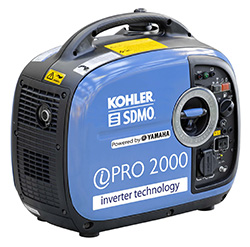

> > > The generator is delivered without oil and petrol.

> > > > This documentation is taken from the manual "Inventory PRO 2000" provided in the IdeasBox, please refer to it for a good understanding of its operation.

[SMDO product presentation documentation ](https://www.kohler-sdmo.com/images/shared/PPW/800/PPW-PR-DO-FR-62.pdf) 

####Caractéristiques

| Gamme                                            | PRESTIGE  |
| ------------------------------------------------ | --------- |
| Frequency (Hz)                                   | 50 Hz     |
| Max power  (kW)                               | 2         |
| Rated voltage (V)                             | 230       |
| Number of phases                                 | Monophasé |
| Fuel                                        | Essence   |
| Tank (L)                                    | 4,20      |
| Consumption 75% (L/h)                                 | 0,90      |
| Autonomy 75% (h)                                | 4,70      |
| Guaranteed sound power level LwA dB((A) | 89        |
| Sound pressure level @1m dB(A)          | 75        |
| Sound pressure level @7m dB(A)          | 60        |

## Capacity and autonomy 

The tank has a capacity of 4.2 L of gasoline.

The autonomy is approximately 4.7 hours.

## Prerequisite

The first time the generator is used, it will need to be filled without

* **Oil** : 0.4 L of SAE 10W30 type oil
* **Gazoline** : 4.2L unleaded gasoline

> > > Get a funnel to fill the oil and fuel tanks 

> > > > Using the funnel, fill the oil tank first and then the fuel tank. If there are any leftovers, it is better to have oil in the gasoline rather than the other way around.

## Putting the device into operation

### Hardware 

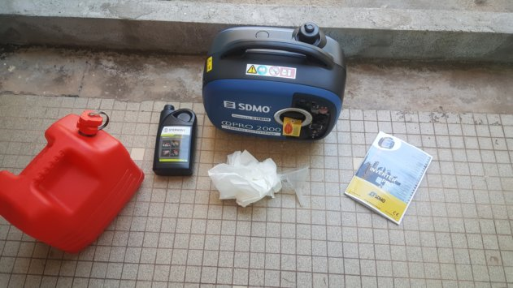

* 1 x 10-15L gasoline canister
* 1 oil tank of 1 to 2 L, SAE 4 stroke 10W30
* Rags
* The user manual
* The generator set

### Topping up the oil

1. Open the oil level hatch

   

   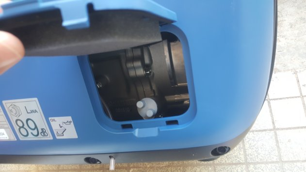
   
2. Remove the filler cap and visually check the oil level, the oil should be flush with the filler neck.

   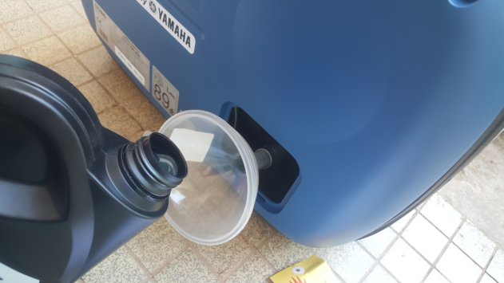

   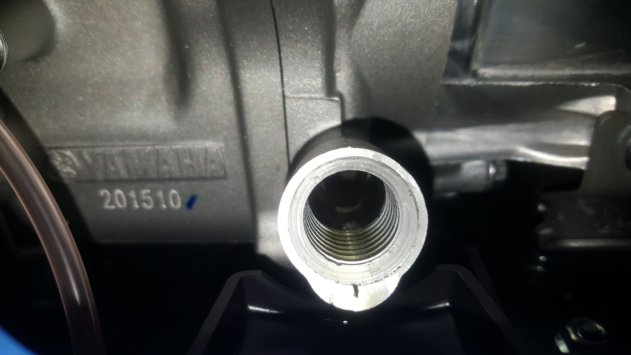

3. If necessary, top up to the level required. 

4. Close cap and hatch

### Filling up the gas tank

1. Visually check the fuel level on the fuel gauge next to the large fuel filler cap. 
   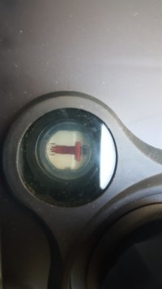
   1. If the level is close to F "Full" the tank is almost full. 
   2. If the level is close to E "Empty" the tank is almost empty.
2. If necessary, fill up to the letter "F" or to the maximum level of the sieve filter
   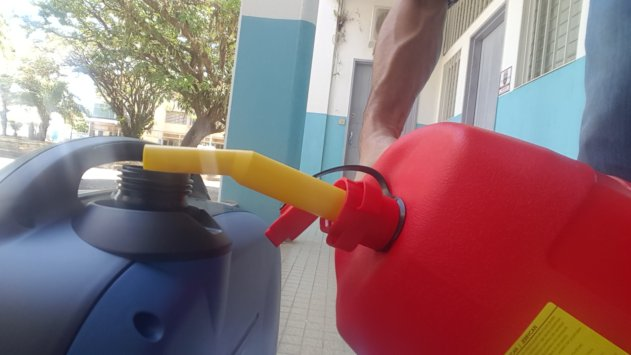

## Starting the generator set

1. Set the switch to the Hare position
   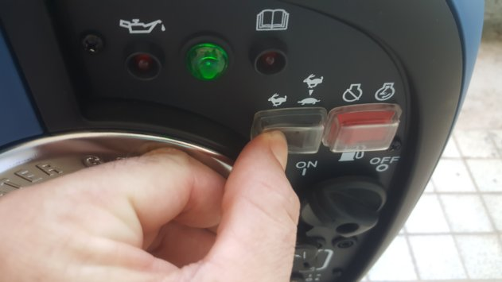
2. Hold the tank cap firmly and turn the tank vent from "OFF" to "ON" on top of the tank
   
3. Turn the fuel valve to the "ON" position. 
   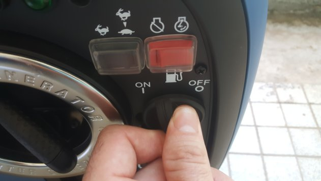
4. Set the ON /OFF switch "pressed" to the right "position". 
   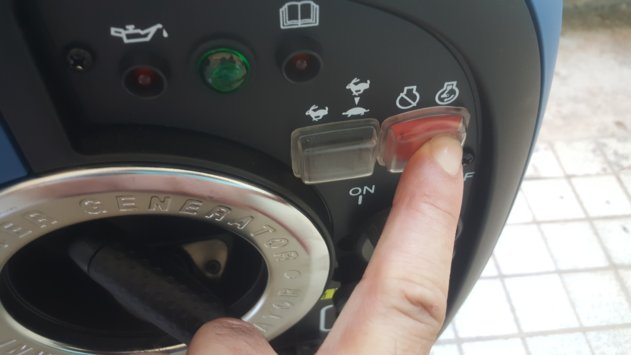
5. Pull the starter if the device is "cold", i.e. if it has not been used within the hour.
   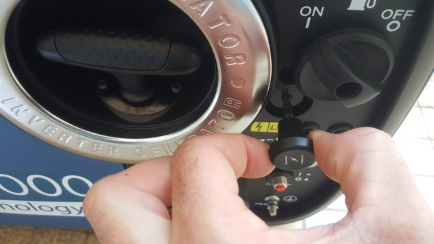
6. Pull the handle of the rewinder launcher slowly until resistance.
7. Then pull the handle of the rewind launcher quickly and strongly until the engine starts. 
   1. The operation indicator lights up

## Shutting down the generator set

1. Turn off and unplug the equipment used
2. Set the economic operation switch to the Hare position and let the generator run idle for a few minutes. 
   
3. Set the ON/OFF switch "pressed" to the left "position". 
   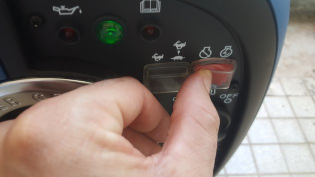
4. Turn the fuel valve to the "OFF" position. 
   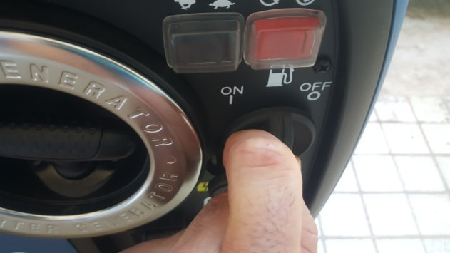
5. Turn the fuel ventilation off by setting it to "OFF".
   

## Maintenance

The number of hours of use of the generator set must be noted so that a precise follow-up of the parts to be maintained can be made.

For the maintenance table, refer to section 5.2 of the due date table in the manual delivered with the generator set.

> > > Refer to section 5.3 for oil change and maintenance in general

## Transport of the device

1. Make sure that all caps are properly closed. 

2. Close the fuel valve  

   

   
3. The device must be transported in an upright position, under no circumstances should it be transported lying on its side
