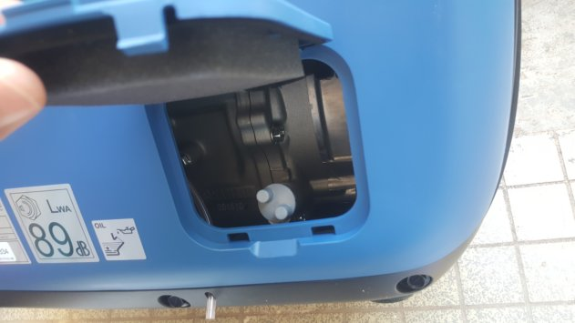
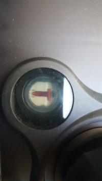
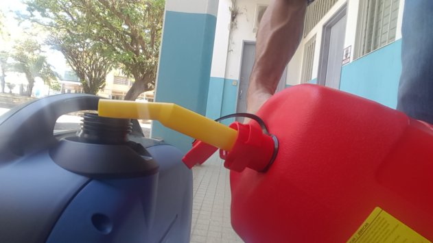
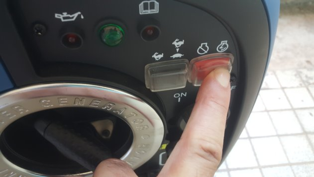
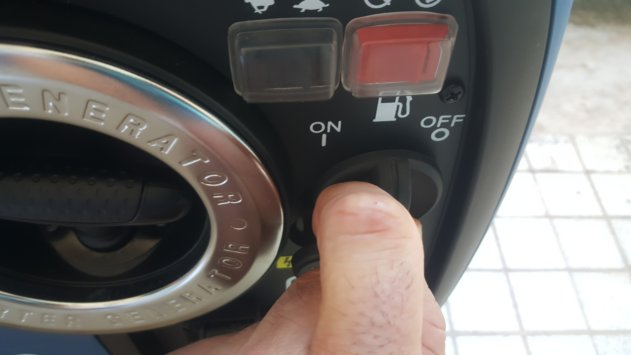

> > > Le générateur est livré **sans huile** et **sans essence**

> > > > Cette documentation est tirée du manuel "Invertaire PRO 2000" fourni dans l'IdeasBox, reportez vous de préférence à ce dernier pour la bonne compréhension de son fonctionnement.

Documentation de présentation des [produits SMDO](https://www.kohler-sdmo.com/images/shared/PPW/800/PPW-PR-DO-FR-62.pdf)

####Caractéristiques

| Gamme                                            | PRESTIGE  |
| ------------------------------------------------ | --------- |
| Fréquence (Hz)                                   | 50 Hz     |
| Puissance max (kW)                               | 2         |
| Tension nominale (V)                             | 230       |
| Nombre de Phases                                 | Monophasé |
| Carburant                                        | Essence   |
| Réservoir (L)                                    | 4,20      |
| Conso. 75% (L/h)                                 | 0,90      |
| Autonomie 75% (h)                                | 4,70      |
| Niveau de puissance acoustique garanti LwA dB(A) | 89        |
| Niveau de pression acoustique @1m dB(A)          | 75        |
| Niveau de pression acoustique @7m dB(A)          | 60        |

## Capacité et autonomie 

Le réservoir a une capacité de 4,2 L d'essence

L'autonomie est d'environ 4,7 heure

## Pré-requis

Lors de sa première utilisation le générateur aura besoin d'être rempli avec 

* **Huile** : 0,4 L d'huile de type SAE 10W30
* **Essence** : 4,2L d'essence sans  plomb

> > > Procurez vous un entonnoir pour remplir les réservoirs d'huile et d'essence. 

> > > > À l'aide de l'entonnoir, remplissez d'abord le réservoir d'huile puis celui d'essence. Si il y a des restes il est préférable d'avoir de l'huile dans l'essence plutôt que l'inverse. 

## Mise en service de l'appareil

### Matériel 

* 1 bidon d'essence de 10-15 L
* 1 bidon d'huile d'1 à 2 L, SAE 4 temps 10W30
* Du chiffon
* Le manuel d'utilisation 
* Le groupe électrogène 

### Faire l'appoint d'huile 

1. Ouvrir la trappe de niveau d'huile

   

   
   
2. Retirez le bouchon de remplissage et vérifiez visuellement le niveau d'huile, l'huile doit affleurer le col de remplissage

   

   

3. Si besoin faire l'appoint jusqu'à obtenir le niveau 

4. Refermer bouchon et trappe

### Faire le plein d'essence

1. Vérifier visuellement le niveau d'essence sur l'indicateur présent à côté du gros bouchon de remplissage du carburant
   
   1. Si le niveau est proche de F "Full" le réservoir est presque plein 
   2. Si le niveau est proche de E "Empty" le réservoir est presque vide
2. Si besoin remplir jusqu'à la lettre "F" ou jusqu'au niveau maximum du filtre tamis 
   

## Démarrer le groupe électrogène 

1. Mettre le commutateur sur la position Lièvre
   
2. Maintenir fermement le bouchon du réservoir et tourner l'aération du réservoir de "OFF" vers "ON" située sur le dessus de ce dernier.
   
3. Tourner le robinet de carburant sur la position "ON"
   
4. Mettre l'interrupteur ON /OFF "appuyé" sur la "position" droite
   
5. Tirer sur le starter si l'appareil est "froid", c'est à dire si il n'a pas été utilisé dans l'heure
   
6. Tirer une première fois la poignée du lanceur ré-enrouleur lentement jusqu'à résistance
7. Tirer ensuite rapidement et fortement la poignée du lanceur ré-enrouleur jusqu'à ce que le moteur démarre 
   1. Le voyant de fonctionnement s'allume

## Arrêter le groupe électrogène 

1. Arrêter et débrancher les appareils utilisés 
2. Mettre le commutateur de fonctionnement économique sur la position Lièvre et laisser le groupe électrogène tourner à vide quelques minutes 
   
3. Mettre l'interrupteur ON/OFF "appuyé" sur la "position" gauche
   
4. Tourner le robinet du carburant sur la position "OFF"
   
5. Fermer l'aération du carburant en le positionnant sur "OFF"
   

## Entretien

Il faut noter le nombre d'heures d'utilisation du groupe électrogène afin de pouvoir réaliser un suivi précis des pièces à entretenir. 

Pour le tableau d'entretien, reportez vous à la section 5.2 du tableau d'échéance présent dans le manuel livré avec le groupe électrogène

> > > Reportez vous aux sections 5.3 pour le renouvellement de l'huile et l'entretien de manière générale

## Transport de l'appareil

1. Assurez vous que tous les bouchons sont correctement fermés 

2. Fermer le robinet de carburant 

   

   
3. L'appareil doit être transporté en position verticale, en aucun cas il doit être transporté couché sur le côté
