Electricity is at the heart of the functionality of the Ideas Box, and knowing how it works allows you to significantly increase the way it can be used.

What follows is intended only for use relating to the Ideas Box, and is not designed to train electricians outside of the Ideas Box.

## The Electrical Circuit

The Ideas Box integrates an electrical circuit.  It is used to: 

* Power the television
* Power the server
* Recharge the tablets via an 18-port USB charger
* Punctually connect other electronic devices (laptop, tablet, printer chargers). Not power appliances!

**All of this can function well, whether powered by the 220-V main power or a 12-V battery while on the move**

#### Following are the electrical components of the Ideas Box

---

* **1 12-V 90-Ah Battery**

  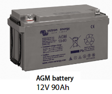
  
The battery is continually charged by its charger.  It plays the role of accumulator, storing energy and delivering 12 V continuously to all the devices connected to its ports \(server, cigarette lighter plugs, 12 V -&gt; 220 V converter\)

>>>** IMPORTANT: ** The battery is considered to be completely dead when the energy output to its ports is less than or equal to 10.8 V

---

* **1 12-V Battery Charger**

  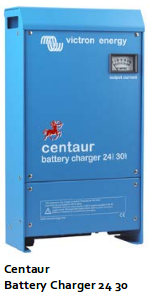
  
This device allows 3 levels of charging for the 12-V battery (bulk - absortion - floating).  It can be connected to the battery permanently without causing any damage to it.

>>>>>**GOOD TO KNOW**: The device has an indicator which can tell you whether or not it is chargering the battery.  The VU-meter (the white box at the top right of the battery) indicates the amount of electricity being tranferred to the battery.  If the needle is pointed towards the right (20, 30 A), the battery is in the process of charging.  If the hand is pointed close to zero, the battery is recharged.

---

* **1 Peren IT 12-V Web Server**

  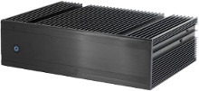
  
This is the server that stores video content, PDFs, and a host of other media. It also creates a WiFi hotspot, and is powered directly by the battery.

---

* **1 Television**

  
  
  The television only works with 220 V of electricity.  When 220 V are not present, it is powered directly by the converter (12 V -&gt; 220 V)

---

* **1 12 V –&gt; 220 V Converter**  

  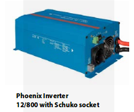
  
This converter permits the creation of a 220-V current in addition to the 12 V from the battery.  Using this converter is obligatory when the Ideas Box is not connected to the 220-V power supply.  Thanks to this converter, it is possible to supply electricity to the cinema module, where the television is, run the server, and charge the laptops.

  Characteristics and specifications:
  * Converter power at 25°C: 800 VA  
  * Converter power at 25°C/40°C: 700 W  
  * Peak power: 1600 W  
  * Low battery alarm: 10.9 V  
  * Maximum yield: 91%

---

* **1 General Power Cord**

  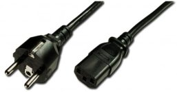
  
The standard two-prong and earth pin plug allows the Ideas Box to connect to a 220-V outlet or a generator.  The other end can plug directly into the male IEC plug of the electrical modules (i.e. the Cinema or Administration modules)

* **1 IEC Plug**

  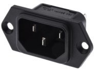

---

* **1 30 mA Differential Circuit Breaker (new version)**

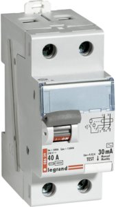

A differential circuit breaker is a protection device capable of interrupting the electrical current in case of an incident or issue on the circuit.

---

* **1 10-A and 16-A Circuit Breaker (new version) **

A circuit protector protects against an overcurrent or circuit overload, and can isolate devices downstream of the circuit breaker from the rest of the circuit.  It helps to think of it as an ON/OFF switch.  The 10A circuit breaker is used, among other things, to protect the 12 V -&gt; 220 V converter.  The 16-A circuit breaker is mainly for the USB charger.

---

* **1 USB Charger **

  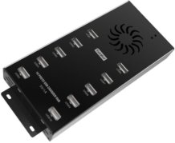
  
  Has 10 or 20 USB ports, allowing simultaneous charging of numerous tablets.

---

* **1 3-Position Switch \(12 V -&gt; 0 -&gt; 220 V\) \(new version\)**

  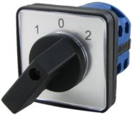

With the new model (that has electricity in the blue model), this switch lets you easily select how much power is supplied to the module.  You can choose to have the module supplied by the main power supply (220 V) or the battery (12 V).

---

* **1 Power Strip**

  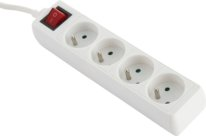
 
The powerstrip can connect directly either to the main 220-V power supply or to the back of the 12 V -&gt; 220 V converter.  It can directly power several devices (ex: charging a laptop) in addition to the battery.

---

* **Cigarette Lighter Plugs (old version)**

  

These plugs can power devices that need to be charged either directly at 12 V, or at 5 V with the help of a 12 V -> 5 V USB converter.  The plugs are directly powered by the battery.

---

### List of Devices Powered by...

#### 220 V

* Television
* 18 port USB charger
* Battery charger (which permits the recharging of the battery)
* A power strip that can connect to four or five other devices

#### 12 V

* The television, with the 12 V -&gt; 220 V converter
* The Peren IT server, directly connected to the battery. It can be connected to the circuit to be transported.  When this happens it is powered with a 220 V -&gt; 12 V converter.  
* A few other devices, depending on their consumption of the 12 V -&gt; 220 V converter.  Since it can only supply 800 watts, it is necessary to limit the number of devices connected to it when the box is on battery. Example usage: Television \(35 W\) + 2 computers \(374 W chacun\) = 773 W.

>>>>>We strongly suggest that you **do not plug the 18 port USB charger** directly into the **12 V -&gt; 220 V converter** because this will drain the battery rapidly.  We suggest that you instead recharge the tablets at night or when you have access to the 220-V main supply.

**Generator Maintenance**:  
Drain the generator every 80 H (about once a month).  It is important to note the hours of operation to keep track of generator usage.

## Simplified Diagram
This diagram illustrates how the battery charger is used alongside the 12 V -> 220 V converter.

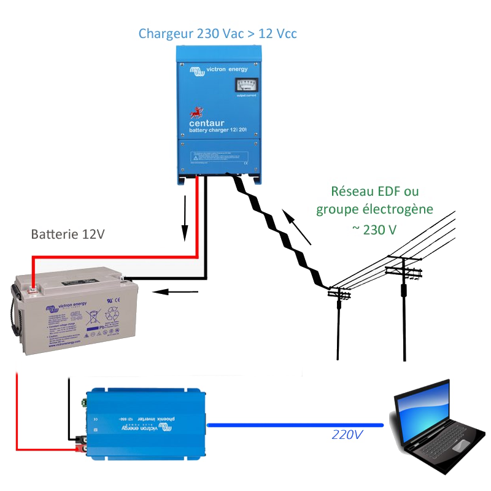

## Practical examples: Energy Balance of the Box

Battery Capacity: 90 Ah @ 12V

Here is a table of the consumption in **Amperes** per **Hour** at 220 V

| Device | Energy Consumption \(A\) | Daily Usage Time \(h\) | Daily Energy Consumption \(Ah/day\) |
| --- | --- | --- | --- |
| TV | 0.16 A | 3h | 0.16 A \* 3h = 0.48 Ah/d |
| Charging Unit | 0.68 A | 8h | 0.68 A \* 8h = 5.44 Ah/d |
| Powering WiFi Antenna | 0.3 A | 7h | 0.3 A \* 7h = 2.1 Ah/d |
| Powering Server | 1.5 A | 7h | 1.5 A \* 7h = 10.5 Ah/d |
| Laptop | 1.7 A | 4h | 1.7A \* 4h = 6.8Ah/d |

Total consumption: 25.3 Ah/d

**The maximum yield of the converter is 91%**

Final summary of the converter's output 12 V -&gt; 220 V = 25.3 Ah / 0.91 = 26 Ah/d

For a battery with a capacity of 90 Ah/d -&gt; we want a maximum discharge of 80% = 90 \* 80 / 100 = 72 Ah are available since we do not want to completely deplete the battery. 

72 Ah / 26 Ah = 2.7h -> The battery can run for 2.7 hours at this rate.

If we are deploying the box for 7h, in a place without electricity, we assume that we only need the server, WiFi antenna, television, and computer chargers for 4h.  Here is an estimation of the time that the battery can function.

| Device | Energy Consumed \(A\) | Daily Usage \(h\) | Daily Consumption \(Ah/day\) |
| --- | --- | --- | --- |
| TV | 0.16 A | 4h | 0.16 A \* 3h = 0.48 Ah/d |
| Powering WiFi Antenna | 0.3 A | 7h | 0.3 A \* 7h = 2.1 Ah/d |
| Powering Server | 1.5 A | 7h | 1.5 A \* 7h = 10.5 Ah/d |
| Laptop | 1.7 A | 4h | 1.7A \* 4h = 6.8Ah/d |

Total Consumption: 19.88 Ah/d

Final summary of the converter's output 12 V -&gt; 220 V = 19.88 Ah / 0.91 = 20.6 Ah/d

For a battery with a capacity of 90 Ah -&gt; we want a maximum discharge of 80% = 90 \* 80 / 100 = 72 Ah are available since we do not want to completely deplete the battery. 

72 Ah / 20.6 Ah = 3.5h -> The battery can function for 3.5 hours
