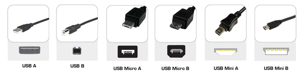
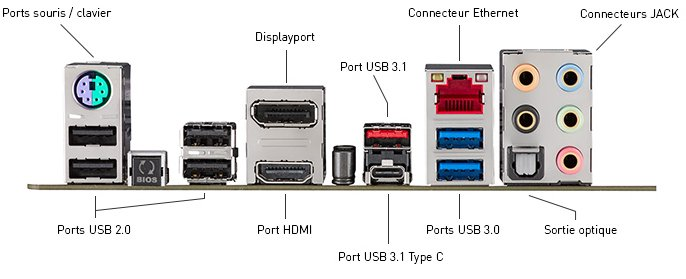
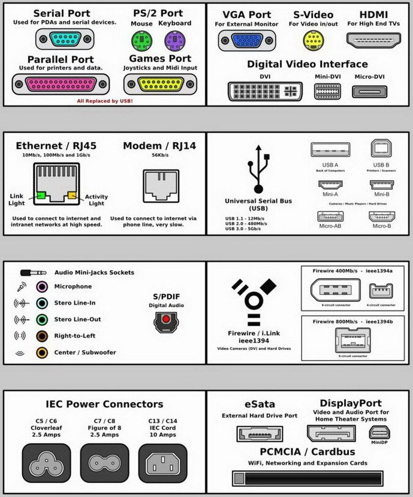

The Ideas Box carries many important electronic devices.  Even though standards have evolved, and the connectivity of equipments has been streamlined, it can still be complex.

Some connectors used in the Ideas Box:

* USB
  * Generally used for recharging devices such as cameras, video players, and telephones
  * Can also be used to transfer data from one device to another.  For example, you can use it to transfer photos from a camera to a computer
  * Generally, USB As and micro/mini USBs Bs are used in this case
* HDMI
  * Is used to transfer the video display from a device like a tablet to a display unit, like a video projector or television
  * A computer or television generally have a standard HDMI, while a tabelet or a video camera generally have a micro HDMI port.

### Different USB Connectors

### Connections Present at the Back of a PC

### General Connections You Will Encounter

