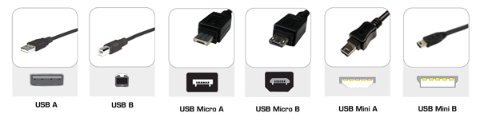

L'IdeasBox embarque un nombre important d'appareils électroniques. Même si les normes ont évolué et que la connectique des équipements s'est rationnalisée, cela peut rester complexe.

Quelques types de connecteurs utilisés dans l'IdeasBox:
* USB
  * Généralement utilisé pour recharger des appareils (appareils photos, vidéos, téléphone)
  * Il sert également à transférer des données d'un appareil à un autre, par exemple transférer des photos depuis un appareil photo vers un ordinateur
  * Généralement l'USB type A et Micro/Mini B est utilisé dans ce cas.
* HDMI
  * Est utilisé pour le transfert de l'affichage vidéo d'un appareil (tablette) vers un afficheur (vidéo projecteur ou télévision)
  * Un ordinateur ou une télévision utilisera généralement un port HDMI standard alors qu'une tablette ou un camescope utilisera une prise Micro HDMI

### Les différents connecteurs USB

### Exemple de connectique présente à l'arrière d'un PC

### Connecteurs généralement rencontrés

