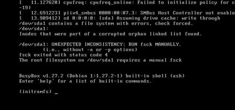

##The server doesn't turn on
**Symptom**: the server doesn't turn on when you press the button 
- Verify that the power cord is correctly plugged in.  Unplug it and plug it back in.
- Verify the battery is charged.
- Try with the power block (supplied with the server) plugged into the 220 V main power.
- If it still doesn't work, the server is defective, and needs to be returned to the manufacturer for repairs.  Contact BSF headquarters. 

## The Ideas Box hotspot doesn't show up
- Connect a screen to the server (a video projector would also work), and verify that the graphical interface is working.
- Restart the server and check if the hotspot has appeared after several minutes.
- Contact Bibliothèques Sans Frontière for remote assitance.

## The screen displays some white text on a black background



The message says `UNEXPECTED INCONSISTENCY` and also suggests that `The root filesystem on /dev/sda1 requires a manual fsck`.
The server was probably shut down brutaly, and the filesystem needs to be checked. At the `(initramfs)` prompt, enter this command:

```
fsck -y /dev/sda1
```

Lines start to flood, a bit or a lot, then the `(initramfs)` prompt comes back. At this point, enter this command:

```
sync
```

When the prompt comes back again, you can shut down the server by keeping the Power button pushed down for a few seconds. The next boot should be flawless.

## I forgot the admin password

* Attach a keyboard, mouse, and screen to the server to access the graphical interface
* Once the screen is connected, use the login name **ideascube** and the password that BSF sent you
* Once connected, click on the icon menu at the lower left and select **System Tools > LXTerminal**
* In LXTerminal, type```ideascube changepassword admin``` (```admin``` can be replaced with another username to change their password).
