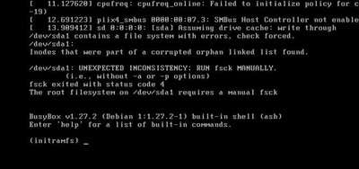

##Le serveur ne démarre pas
**Symptôme** : le serveur ne s’allume pas quand on appuie sur le bouton.
- Vérifier que le connecteur d’alimentation est  correctement enfiché. Le débrancher et le rebrancher.
- Vérifier que la batterie est chargée
- Essayer avec le bloc d'alimentation fourni avec le serveur et le brancher sur le secteur 220V.
- S’il ne s’allume toujours pas, le serveur est matériellement défaillant et doit être retourné au constructeur pour réparation. Contacter le siège de BSF. 

## Le hotspot IdeasBox n'apparait pas
- Connecter un écran au serveur (à défaut, un vidéoprojecteur) et vérifier que l’interface graphique fonctionne. 
- Redémarrer le serveur une première fois et attendre quelques minutes, vérifier si le hotspot apparaît à nouveau.
- Contacter BSF pour une intervention à distance 

## L'écran affiche du texte blanc sur fond noir



L'écran affiche un message `UNEXPECTED INCONSISTENCY` et indique également `The root filesystem on /dev/sda1 requires a manual fsck`.

Le serveur a probablement été éteint brutalement, et le système de fichier doit être vérifié. Au prompt `(initramfs)`, tapez la commande suivante :

```
fsck -y /dev/sda1
```

Des lignes défilent, entre un peu et vraiment beaucoup, puis le prompt `(initramfs)` s'affiche de nouveau. Tapez alors la commande suivante :

```
sync
```

Lorsque le prompt réapparait, vous pouvez éteindre le serveur en maintenant le bouton Power appuyé. Le prochain démarrage devrait se dérouler sans souci.

## J'ai perdu le mot de passe admin

* Brancher un clavier, une souris et un écran au serveur pour accéder à l'interface graphique.
* Une fois l'écran branché, rentrer le login : ```ideascube``` et le mot de passe que BSF vous a transmis
* Une fois connecté, cliquer en bas à gauche sur l'icône menu et sélectionnez "Outils système > LXTerminal"
* Dans le LXTerminal, taper : ```ideascube changepassword admin``` (```admin``` ou un autre utilisateur).

## J'ai perdu le chargeur

Ou son embout.

Le serveur encaisse une tension de 7V à 20V, il faut préférer le 12V.

Au bout du chargeur, le connecteur est détachable. Il peut arriver qu'on en perde l'embout. Celui-ci peut se trouver assez facilement dans le commerce.
Cependant il faudra faire attention à son format : il ressemble à un embout "classique" 2.5/5.5, mais tous les embouts 2.5/5.5 ne rentrent pas dedans.
Histoire de s'éviter des surprises, on prendra soin d'emmener le sreveur en magasin afin de tester le potentiel achat et s'assurer qu'il rentre bien dans la prise femelle.
