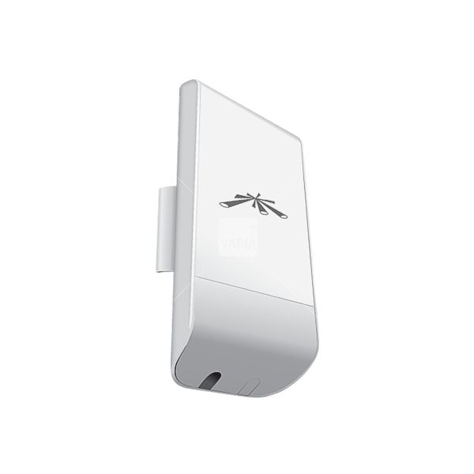
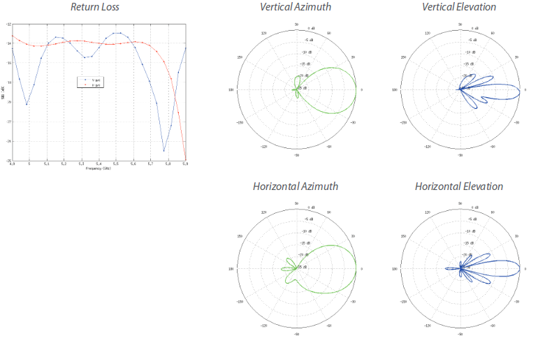

Ubiquiti WiFi antennas allow you to establish wireless connections.
They support 3 operation modes:

- Station
- Acces point
- AP-Repeater

In our context, we use WiFi antennas in the **Access Point** and **Station** modes, in order to create a WiFi connection between two antennas that can distrbute the internet across a large area.

>>>>>**Before any deployment, it is absolutely necessary to conduct a feasibility study to have a quick overview of what the hardware will be able to do.**

The key is to base your study on photos taken between point A and point B to determine if a direct link can be established.  This is certainly the most important step!

Next, it is [possible to calculate the loss in dB](https://www.pasternack.com/t-calculator-fspl.aspx) between two antennas if you know the antenna gain, the distance between two points and the frequency used.  For example, a tree situated between the two antennas will decrease the signal power by 5dB.

[Use AirLin](https://airlink.ubnt.com/), an online too distributed by Ubiquiti in order to verify the distance between point A and point B.  The software will also give you an indication of the elevation of the terrain and the height necessary for the mast supporting the antenna.
You can also check with [GeoPortail](http://www.geoportail.gouv.fr). If the Ideas Box will be deployed in France, you will have access to the altitude of your installation site.  It is always good to cross-check the information.  If not, use Google Maps or Open Street Maps to get an idea of buildings which could be located between the antennas.

In order to function well, the antennas need to "see eachother."  It is thus essential to place them at a good height.  If a building is located between the antennas, it is very possible that the connection will not be able to be established.

If you cannot visit the location yourself, discuss the site with your partners to get as much information about it as possible, such as:
- GPS coordinates of point A and point B
- Altitude of the two points
- Nature of the buildings around point A and B (local, house, appartment building, number of floors, can you attach the antenna somewhere, can you mount the antenna, etc...)
- Are there tall buildings between point A and point B?
- Can the antenna be placed higher than these buildings?

##Technical specifications
* Model: [Nanostation M5](http://www.ldlc.com/fiche/PB00142273.html) 
* Guide price: 99 €
* Power: 0.5 A @24 V (power supplied)
* Max power consumption: 8W  
* Gain: 16 dBi
* Temperatures at which antenna can function: -30 à 75°C  
* Frequencies at which antenna can function: 5170 - 5875 Hz
* Beamwidth: 43° (H-pol) / 41° (V-pol) / 15° (Elevation)

The diagrams below give the vertical and horizontal angles covered by the WiFi antenna.  For example, you can see that the "Vertical Elevation" has an angle that permits it to send the waves towards the ground rather than into the air.

---

## Generalizations about the Radio

*A radiocommunication is a telecommunication performed in the air using electromagnetic waves.  These waves constitute a transmission of energy that manifest itself in the form of an electric field couples with a magnetic field.  The information is transported thanks to constant modulation of the properties of the wave (its amplitude, frequency, phase, or wavelength among other things)  See [wikipedia](https://fr.wikipedia.org/wiki/Radiocommunication) for more information.*

**Units**
* Frequency: hertz
* Bandwidth: hertz
* Power: watt

The WiFi network functions on the following frequencies: 2.4 ghz or 5 ghz

It is possible to calculate the range of a WiFi network with the following formula:

**D = G x P**
 - D: distance
 - G: Antenna gain in dBi
 - P: Power in watts

## Configuration and Implementation

### Materials Required
* Buy several passive adapters 
* Bring a multimeter (normally in the suitcase)
* Bring zipties in the box (need to be added to the suitcase)
* Bring **PLENTY** of Ethernet cables

### First Connection

Follow the assembly instructions included in the antenna box.  Two networking cables will be necessary for assembly.

For the first time you use the antenna, it will be accessible at this address: [http://192.168.1.20](http://192.168.1.20).  Verify before starting up the antenna that this IP address is not attributed to another machine.  If that is the case, this will cause a IP address conflict, and your antenna will not be accessible.

Once connected to this webside, enter the default identifiers (which will be changed after logging in for the first time):

**Login: **ubnt   
**Password: **ubnt

Disactivate https in order to access the admin console.

-----

**Note about the airMAX Protocol:**
*airMAX is Ubiquiti’s proprietary Time Division Multiple 
Access (TDMA) polling technology. airMAX improves 
overall performance in Point-to-Point (PtP) and 
Point-to-MultiPoint (PtMP) installations and noisy 
environments because it reduces latency, increases 
throughput, and offers better tolerance against 
interference.*  
Given that this protocol is proprietary, we prefer to leave it inactive as much as possible. 

**Note about airView: **  
*Use the airView Spectrum Analyzer to analyze the noise 
environment of the radio spectrum and intelligently select 
the optimal frequency to install a PtP airMAX link. *

>>>>>> Each time the configuration is changed, do not forget to click **Apply** to apply your changes.

## First Antenna 
This is the antenna that will deliver internet access and will thus be connected to the network of networks.

### First Tab
- Uncheck the airMax option\

### WIRELESS Tab
The consumption is about 3 to 4 watts.

- **Wireless mode**: Access-Point
- **Activate WDS**
- **SSID**: Select an SSID, which must be the same for the two antennas
- **Country Code**: Every country uses its own regulations about the standards for radiocommunication.  Choose the country in which you will be deploying the equipment.
- **Channel Width**:  Choose `20 Mhz`. The higher this number, the faster the transmission of data will be.  However, this frequency is also compatible with the standard WiFi used by mobile devices.  It is also possible to use the parameter: `Auto 20/40Mhz`
- **EIRP Limit**: Check this box, which will constrain the device to the rules defined by the **country code**.  However, if you have a problem with the connection between the two antennas, uncheck `EIRP Limit` and put the `output power` slider to the bottom.  However, be aware that the equipment no longer is respecting the country's laws and may expose your or your partner to lawsuits.
- **Wireless security**: Choose WPA2 and choose a password
- **Frequency**: Choose 5180. When you use antennas in relay mode, choose two distant frequences to avoid interference between the frequencies. 

### NETWORK Tab
- **Network Mode**: Bridge
- **Management Network Settings**: Static
- **IP Address**: Choose an IP address available on the network and, if possible, block this IP adress in the DHCP server so it cannot be attributed to another machine. 
**Attention: ** The two WiFi terminals have to be on the same network in order to be able to communicate.

### ADVANCED Tab
- **Instal EIRP Control**: Check this box

## 2nd Antenna 

### WIRELESS Tab
The consumption is about 3 to 4 watts

- **Wireless mode**: Station
- **Activate WDS**
- **SSID**: Select the same SSID that you did for the first antenna
- **Country Code**: Every country uses its own regulations about the standards for radiocommunication.  Choose the country in which you will be deploying the equipment. 
- **Channel Width** : Choose `20 Mhz`. The higher this number, the faster the transmission of data will be.  However, this frequency is also compatible with the standard WiFi used by mobile devices.  It is also possible to use the parameter: `Auto 20/40Mhz`
- **EIRP Limit**: Check this box, which will constrain the device to the rules defined by the **country code**.  However, if you have a problem with the connection between the two antennas, uncheck `EIRP Limit` and put the `output power` slider to the bottom.  However, be aware that the equipment no longer is respecting the country's laws and may expose your or your partner to lawsuits.
- **Wireless security**: Select WPA2 and choose a password
- **Frequency**: Choose 5180. When you use antennas in relay mode, choose two distant frequences to avoid interference between the frequencies.

### NETWORK Tab
- **Network Mode**: Bridge
- **Management Network Settings**: Static
-  **IP Address**: Choose an IP address available on the network and, if possible, block this IP adress in the DHCP server so it cannot be attributed to another machine.     
**Attention: ** The two WiFi terminals have to be on the same network in order to be able to communicate.

## Troubleshooting and Advice
**Chan IRC**: `#tetaneutral` on freenode or `#lqdn` guerby    
**To debug**: tcpdump or wiresharkœ + ping

## Reference Documents: 
- [Wikipedia](https://en.wikipedia.org/wiki/Ubiquiti_Networks)
- [Product Page](https://www.ubnt.com/airmax/nanostationm/)
- [Quick start guide](https://dl.ubnt.com/guides/NanoStation_M/NanoStation_M_Loco_M_QSG.pdf)
- [AirOS Guide](https://dl.ubnt.com/guides/airOS/airOS_UG.pdf)
- [Data Sheet](https://dl.ubnt.com/datasheets/nanostationm/nsm_ds_web.pdf)