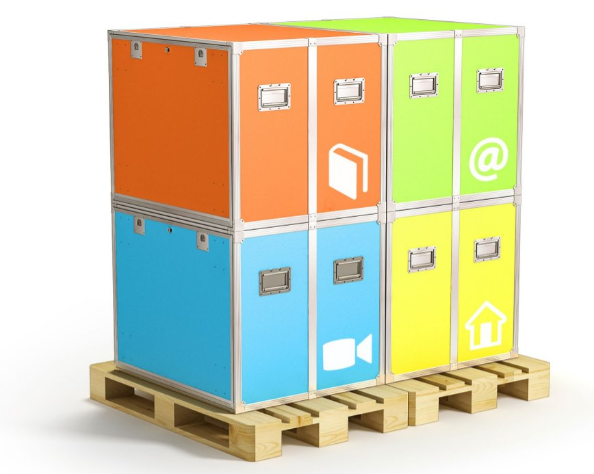

* **Volume**: During transport, an Ideas Box represents a total of 2 pallets (see image bellow) of European standard size – (EUROPAL - 80*120cm) = around 3 m3
* **Weight**: the total weight of the package (2 pallets + 6 modules) is 760 kg. The individual modules weigh between 50kg (for the new versions) and 80kg (for the first versions)
* Dimensions:
  * Modules: 90 cm (width) x 85 cm (height) x 78 cm (depth)
  * Boxes for tables: 144 cm x 30 cm x 178 cm
* **Power**: the Ideas Box once deployed only requires an electrical outlet (220v 10A or 110v with ground). You will find more details in the section [electricity in the ideasbox](http://ideasbox.doc.bibliosansfrontieres.org/en/electricity-in-the-box) of this guide.
* **Internet access**: the Ideas Box does not **provide Internet access**. However, the computer equipment provided, [computers](http://ideasbox.doc.bibliosansfrontieres.org/en/computers) and tablets, make it possible to connect to an existing wifi network. The Ideasbox also comes with an [Ideascube](http://ideascube-hardware.doc.bibliosansfrontieres.org/en) allowing access to more than 300 GB of digital resources selected for projects.

