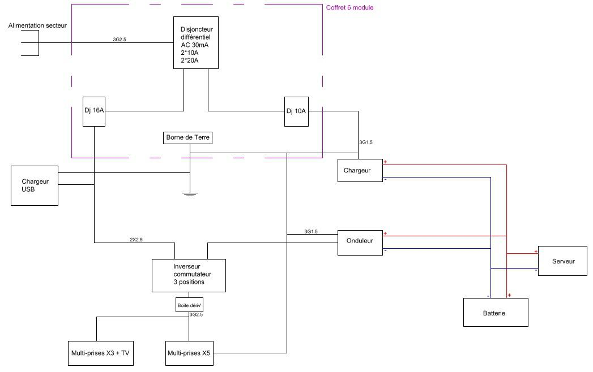

## Handling

**Reminder**: the modules are very heavy, even when empty

- **80 kg** for the original versions,
- **50 kg** for the new versions (Hemingway).

_When you are handling a module:_

- make sure there are enough of you to carry it: ideally four people.
- never lift using your back, bend your knees and lift using your legs.
- avoid wearing open-toed shoes (e.g.: flip-flops).
- wear gloves when handling modules without wheels.
- when loading a module into a vehicle or unloading one from a vehicle: remove any loose items from the box (books, laptops, generator, and anything else that can be removed) to reduce the module's weight
- when travelling: make sure the modules do not collide with each other.  Do not use the wheels to push anything in your way (you may damage the bearings), make sure you remove the castor brakes before moving the modules. Protect the modules with cardboard or fabric where necessary.
>>>> old model - **Warning for the grey modules:** the handles are poorly positioned (you may trap your fingers if you pick it up the wrong way). Always use gloves when handling the grey casing.

## Assembly/Disassembly

To install or remove the wheels, the modules must be turned onto their side. Caution: the yellow module contains the generator. Remove the generator before tipping the module.

### Wheels

- Tighten the screws
- Install two wheels fitted with brakes on the same side
- Be careful when you put the module on the wheels: **do not exert force on the wheels**. This could damage the bearings and the screw thread (ease the module down as you turn it from its side onto its wheels).

### Opening/closing the box

- You must open the Ideas Box on a flat surface. This will stop the modules from becoming misshapen due to a slope and will make it easier to open the modules and the doors.
- Old model -  Do not exert pressure when closing the modules as this could scratch the stickers on the sides of the modules.
- Old model -  Do not exert pressure when closing the modules as this could deform the rail into which the detachable
doors are inserted.
- Old model -  For the legs of the grey module, assemble the leg locking mechanisms, and open them slowly. Install the adjustable legs. It is important that the module is on a flat surface so that the lids are not twisted.
- Old model -  Separate the casing that can be used as a seat (blue, orange) from that which can be used as a table (green, yellow). Do not forget to install additional sleeves in order to reinforce the casing.

## Storage

The Ideas Box modules and tables must be stored in a covered, dry, indoor, area. The Ideas Box **must not be left out in the rain**, in particular the blue module as heavy rain may leak in even when the module is closed.

It is easier to store the Ideas Box on its wheels. However, if due to space restrictions you have to stack modules for storage, you must remove the wheels. Never stack more than two modules. Secure them with a strap. Place the heavier modules at the bottom.

When the box is stored, close all modules and secure everything with an anti-theft chain. Insert it through the Ideas Box’s handles and the hole in the middle of the tables to secure all items. 

## Transport

To transport the Ideas Box in a vehicle, you must:

- remove the wheels
- empty all fluids out of the generator 
- secure the modules with a strap
- stack no more than 2 modules
- place the heavier modules at the bottom

## Upkeep

### Modules

Clean with a (washable) cloth and a product such as window-cleaning liquid or car washer fluid. Do not use any corrosive products (acid, alcohol, acetone, etc.).

Do not bump the modules.  Protect the wood if it is being used as a table since metal items may leave scratches. 

Do not grease or oil the mechanical parts (drawer rails, hinges, closing flaps, locks, etc.) as these substances could attract dust.

### Tablets

Clean tablets and laptops, especially screens. Method: spray some cleaning product on a cloth and clean the equipment. Do not spray directly onto the screens. If in doubt as to whether the product is appropriate, start in a corner of the screen to avoid scratching or damaging the center. The equipment must be switched off and remain so for a few minutes once cleaned. 

Tablets: never place screens on a hard surface, always on fabric.

### Computers

Blower: blowers must be added in the IDB. To dust a computer, switch it off and use the blower in the air vents. This must be done once a week. The computer must remain switched off for 30 minutes after using the blower, due to the moisture which could form on the internal electronic components. 

Dust, with special attention to televisions and PC screens. Remember to use a blower regularly to avoid dust build-up on electronic equipment. The same is applicable to books. 

## Maintenance

During its use, the Ideas Box may be damaged in several ways.

### Furniture repairs

The Ideas Box was designed to be easily repaired and the equipment in the Box is available almost everywhere in the world. A carpenter could conduct all repairs on an Ideas Box. 

The most fragile parts are the module door locks and the low table legs (in the new models).

### Electrical repairs

Before attempting any repairs, even measuring the battery’s charge, please read the “General safety information” section of the “Electricity in the Ideas Box” page.

If the electrical circuit no longer works, this could be due to the battery’s charge. To test this, use the multimeter found in the Ideas Box. If the battery’s charge is below 12 volts, charge it for 8 hours.

If, once the battery is fully charged, the problem continues, do not attempt to conduct any repairs yourself. 
**Contact an electrician**. This document will be necessary:

#### Electrical diagram of the Ideas Box

- Alimentation secteur – Main power
- Coffret 6 module – 6-module kit
- Disjoncteur différentiel – Residual current circuit breaker
- Dj – Circuit breaker
- Chargeur USB – USB charger
- Borne de terre – Earth terminal
- Chargeur – Charger
- Inverseur commutateur 3 positions – 3-position changer/switch
- Ondulateur - Inverter
- Serveur – Server
- Batterie – Battery
- Boîte dérivation – Junction box
- Multi-prises – Multiple socket

### Electronic equipment repairs

If the server breaks down, contact Libraries Without Borders (LWB).

For any other devices, LWB cannot replace any equipment. However, equipment is provided with a warranty (tablet, laptop, e-readers, generators).

You must contact the manufacturer. Equipment is under warranty for one year.