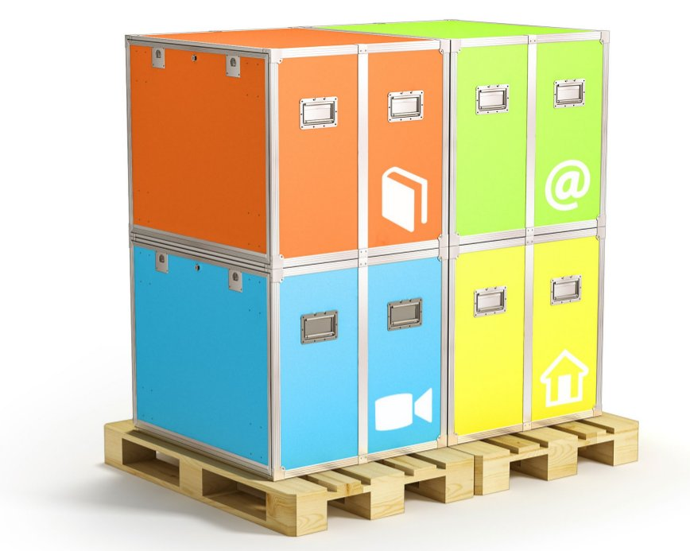

## Déploiement

**Idéalement, une fois déployée, 100m2** sont nécessaires pour l’Ideas Box afind’accueillir les usagers et de faciliter leur circulation entre les modules. Néanmoins, l’Ideas Box est un dispositif modulable qui peut-être adapté à la plupart des configurations. Une installation « partielle » peut être envisagé sur une surface moindre (**>30m2**). **Un sol lisse** est nécessaire pour permettre de faire rouler les modules. Si les conditions météorologiques le permettent, l’Ideas Box peut être déployée en extérieur.

Il faut compter environ **20 minutes** pour l'installation et un temps équivalent pour le rangement.  

Il est également conseillé d’avoir un point d’eau dans l’espace de déploiement et/ou stockage de l’Ideas Box (pour que les usagers se lavent les mains à l’entrée). 

Lorsque vous manipulez un module (relativement lourds, entre 50 et 80° kg selon les éqiupements de votre box) :

* faites-le à plusieurs, idéalement 4 personnes.
* ne jamais plier le dos, mais les genoux.
* évitez les chaussures ouvertes \(ex : tongs\).
* mettez des gants en cas de manipulation de modules sans roulettes.
* lors du chargement/déchargement d'un véhicule : enlevez de la box tout ce qui peut l'être \(livres, PC portables, générateur\) pour alléger les modules.
* pendant les déplacements : évitez d'entrechoquer les modules, ne pas forcer sur les obstacles avec les roulettes \(risque de détériorer les roulements\), s’assurer que les freins des roulettes sont enlevés  _ pour effectuer les déplacements. Protégez les modules avec un carton  _ ou un tissu au besoin.
* _Ancien modèle_ Avertissement sur les modules gris : les poignées  _ sont mal placées \(on se pince les doigts si on le prend à l'envers\),  _ utiliser systématiquement des gants pour la manutention des coques grises.

## Montage / démontage

Pour mettre ou enlever les roulettes, il faut basculer les modules sur le côté. Attention, le module jaune contient le générateur. Enlevez le générateur avant de pencher le module.

### Roulettes

* Serrez bien les vis,
* Montez les deux roulettes freinées en diagonale.
* Faites attention lorsque vous remettez le module sur roulettes :  _ **ne pas forcer sur les roulettes**. Cela risque d'abîmer les  _ roulements et les pas de vis \(soulagez le module avant de le reposer du flanc sur ses roulettes\).

### Ouverture / fermeture

* Lorsque vous déployez l'IdeasBox, il est nécessaire de le faire sur un sol plat. Cela évitera que les modules soient déformés par la  pente et rendra l'ouverture des modules et des portes d'autant plus facile.
* _Ancien modèle_ Ne forcez pas lorsque vous refermez les modules afin d'éviter de rayer les autocollants sur les flancs des modules.
* _Ancien modèle_ Ne forcez pas lorsque vous refermez les modules afin d'éviter de déformer le rail dans lequel viennent s'insérer les  portes amovibles.
* _Ancien modèle_ Pieds modules gris : monter les mécanismes de verrouillage des pieds, nécessité de les déployer doucement, monter les pieds réglables. Insister sur la nécessité de poser le module à plat afin de ne pas vriller les couvercles.  
* _Ancien modèle_ : Il faut différencier les coques qui peuvent servir d'assise \(bleu, orange\) de celles qui ne peuvent servir que de  table : vert, jaune. N'oubliez pas de monter les manchons supplémentaires qui permettent de renforcer les coques.

## Stockage

Les modules et tables de l'IdeasBox doivent être stockés dans un endroit couvert, au sec, en intérieur. L'IdeasBox ne doit pas rester sous la pluie, spécialement le module bleu qui comporte des risques d'infiltration même fermé lorsque la box est sous une forte pluie.

Il est plus simple de stocker l'IdeasBox montée sur roulette. La surface nécessaire pour ranger les 4 modules sur roulettes est de **9m2** au sol.  Cependant, si pour des raisons de place vous devez stocker les modules les uns sur les autres, il est indispensable de démonter les roulettes et de les solidariser avec une sangle. Mettez les modules les plus lourds en dessous. Ne superposez pas plus de 2 modules.

Lorsque la box est stockée, fermez tous les modules et sécurisez le tout avec une chaîne antivol. Passez la dans les poignées de l'IdeasBox et le trou au milieu des tables pour solidariser le tout.

Si l'Ideasbox n'a jamais été déployée, vous pouvez également la stocker sur **palette**. La **surface nécessaire est alors de 3 m3** avec une **hauteur minimale de 1,65m**. 

## Transport

Pour transporter l'IdeasBox dans un véhicule il est indispensable de :

* démonter les roulettes
* vider le générateur de tous ses fluides
* solidariser les modules avec une **sangle**
* Ne pas empiler plus de 2 modules
* mettre les modules les plus lourds en dessous

Le véhicule doit faire **12 m3** minimum et doit être éqiupé d'un hayon ou d'une rampe. Les modules doivent être attachés à l'aide d'une sangle. 

Sur roulettes : le lieu d’installation (ou de stockage), doit être accessible par rampe ou ascenseur (porte > 80 cm de largeur).

## Caractéristiques techniques générales

* **Volume** : Lors du transport, une Ideas Box représente un total de 2 palettes (voir image ci-dessus) de taille standard européenne – (EUROPAL - 80*120cm) = environs 3 m3
* **Poids** :  le poids total du colis (2 palettes + 6 modules) est de 760 kg. Les modules individuels pèsent entre 50Kg (pour les nouvelles versions) et 80kg (pour les premières versions)
* Dimensions : 
  * modules 90 cm (largeur) x 85 cm (hauteur) x 78 cm de profondeur
  * Les caisses pour les tables 144 cm x 30 cm x 178 cm
* **Energie** : les Ideas Box une fois déployées ne nécessitent qu’une prise électrique (220v 10A ou 110v avec terre). Vous trouverez pus de détails dans la partie [l'électricité dans l'ideasbox](http://ideasbox.doc.bibliosansfrontieres.org/fr/electricity-in-the-box) de ce guide.
* **Accès internet** : l’Ideas Box ne **fournit pas d’accès Internet**. Cependant le matériel informatique fourni, [ordinateurs](http://ideasbox.doc.bibliosansfrontieres.org/fr/computers) et tablettes, permettent de se connecter à un réseau wifi existant. L'ideasbox est également fournie avec un [ideascube](http://ideascube-hardware.doc.bibliosansfrontieres.org/en) permettant d'accéder à plus de 300 GO de ressources numériques sélectionnées pour les projets.

